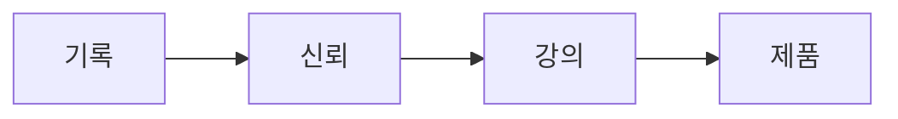

# 소개

안녕하세요. **근성(권태향)** 입니다. 저는 *AI를 잘 쓰는 사람*이 아니라 **AI를 다루는 사람**이 되려고 합니다. 하네스 엔지니어이자 창업가로서, 모델 하나를 똑똑하게 만드는 일보다 **여러 AI를 규칙·역할·검증으로 묶어 안정적으로 일하게 만드는 구조(harness)** 를 설계하는 데 관심이 있습니다.

## 쉽게 말하면

> **한마디로:** 여기는 광고용 블로그가 아니라, 제가 일하며 배운 것을 공개로 쌓는 **지식정원**입니다. 비공개 위키에 쌓은 노트 중 "공개" 도장을 받은 것만 이 사이트로 나옵니다.

운영 흐름은 단순합니다 — **기록**해서 **신뢰**가 쌓이고, 그 신뢰로 **강의**하고, 끝에 자연스럽게 **제품**이 있습니다.

## 이 사이트는 무엇인가

이곳은 블로그가 아니라 **공개 지식정원(public knowledge garden)** 입니다. 제 개인 위키에 쌓인 노트 가운데 `visibility/public` 게이트를 통과한 것만 단방향으로 발행됩니다. 그래서 글은 완결된 칼럼이 아니라 **계속 자라고 고쳐지는 노트**에 가깝습니다.

- **원천(DB)**: 비공개 Obsidian 위키
- **발행물(렌더러)**: 이 Quartz 사이트
- **원칙**: 지식은 위키에만 쌓고, 노출은 태그로만 통제한다(원본 보존, 역기록 금지)

## 무엇을 다루나 — 5개 대분류

기록은 다섯 갈래(대분류)로 정리되고, 각 대분류 안에 다시 중분류가 있습니다.

- **[[agents-harness/index|에이전트 & 하네스]]** — 에이전트 역할·카탈로그부터 하네스 운영 규칙·작업/품질·복구·연속성까지 (핵심 전문성)
- **[[knowledge/index|지식관리 & 도구]]** — Obsidian × 생성형 AI · 발행 파이프라인 · 로컬 LLM
- **[[business/index|창업 & 비즈니스]]** — 창업 × AI · 회사·마케팅 인텔(REUEL MASION) · 제품(Peek·ChannelDock) · AI 인테리어(비주력)
- **[[projects/index|프로젝트]]** — 운영·지식 시스템 · 앱·플러그인 · 웹·비주얼 · 비즈니스·교육 설계
- 그리고 지금 보고 계신 **소개**.

## 왜 공개하나 — 기록에서 제품까지

운영 목적은 단순한 퍼널로 이어집니다.

1. **기록** — 실제로 일하며 배운 것을 공개로 남긴다.
2. **신뢰** — 공개된 기록이 모여 전문성과 신뢰가 된다.
3. **강의** — 그 신뢰를 바탕으로 신생 기업·실무자에게 강의로 전한다.
4. **제품** — 자연스럽게 [[business/products/index|Peek·ChannelDock]] 같은 제품을 소개한다.

즉, *팔기 위해 쓰는 글*이 아니라 *쓰다 보니 신뢰가 쌓이고 그 끝에 제품이 있는* 순서입니다.

## 회사

저는 **REUEL MASION** 의 이름으로 AI를 활용한 제품과 서비스를 만듭니다. 자세한 회사·산업 리서치는 [[business/company-intel/index|회사 인텔]] 허브에 정리합니다.

## 연락 · 구독

- **GitHub**: (준비 중)
- **이메일**: (준비 중)
- **RSS**: 사이트 피드로 새 노트를 구독할 수 있습니다(준비 중)

> 연락처와 피드 주소는 정식 공개 후 이 페이지에서 업데이트됩니다.
