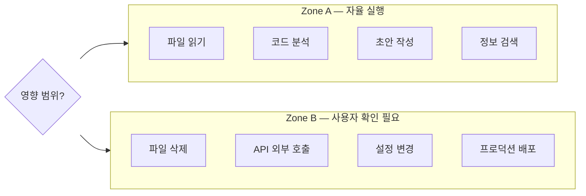

# 에이전트 의사결정과 에스컬레이션

하네스의 중심 통제 아이디어다. AI의 행동은 두 구역 중 하나에 속하고, 엄격함 순서의 우선순위 사슬이 충돌을 정리한다. 같은 모델이 [[agent-workflow-diagram]]에서 의사결정 트리로 다시 표현되고, [[agent-decision-rules]] / [[ai-master-constitution|헌법]] 7조에 성문화되어 있다.

## 쉽게 말하면

> **한마디로:** AI가 **혼자 해도 되는 일**(되돌리기 쉽고 안전한 일)과 **사람에게 먼저 물어야 하는 일**(삭제·배포·보안)을 딱 두 칸으로 나눕니다.

규칙끼리 부딪히면 **더 엄격한 쪽**을 따릅니다. 그래서 시스템은 항상 "안전하게 묻는 쪽"으로 기웁니다. 아래 그림이 그 경계선입니다.

## 2구역 모델

- **자율 구역** — *모든* 게이트를 통과할 때만 묻지 않고 실행한다: 되돌릴 수 있음, 범위 명확, 보안 위험 없음, 데이터 손실 없음, 외부 영향 없음. (새 문서, 범위 내 편집, 로컬 수정, 읽기.)
- **에스컬레이션 구역** — *어느 하나*라도 트리거가 발동하면 먼저 확인한다: 파괴적(삭제/덮어쓰기/50개 이상 파일/DB truncate), 외부 영향(push/배포/외부 전송/공개 업로드), 보안/기밀(권한, 자격증명, Mark9 유출), 전문 책임(의료/법률/금융 확정), 방향 불명확(해석이 갈리거나 기존 작업과 충돌).

## 자율 실행(Zone A) vs 사용자 확인(Zone B) 분기 구조

*위 다이어그램은 영향 범위 및 위해 가능성에 따른 Zone A 자율 실행과 Zone B 에스컬레이션의 경계를 설명합니다.*

## 의사결정 트리 (워크플로우 형태)

파괴적? → 확인. 아니면 보안 위반? → 중단 + 보고. 아니면 50개 이상 파일? → 확인. 아니면 → 진행. 이 비대칭은 의도적이다: 에스컬레이션 트리거는 하나만 걸려도 막지만, 자율은 모든 게이트를 통과해야 한다 — 시스템은 묻는 쪽으로 편향되어 있다.

## 엄격함 우선 사슬

규칙이 충돌하면: 사용자 지시 → 헌법 → 하네스 → 공유 허브 → AI별 설정 → 프로젝트 설정 → 볼트 관례 순으로, 그 안에서 **더 엄격한** 규칙이 언제나 이긴다. 편의가 더 엄격한 규칙을 완화할 근거가 되지 않는다.

## 왜 중요한가

이것이 세 자율 에이전트를 공유 파일 시스템에서 안전하게 돌릴 수 있게 하는 단 하나의 개념이다 — "알아서 판단해"를 명시적이고 감사 가능한 게이트로 바꾼다.

## 관련

- [[agent-decision-rules]] · [[ai-master-constitution]] · [[ai-agent-roles]]

## 출처

내부 하네스 규칙 문서(`00_Harness/agent-decision-rules.md`, `ai-master-constitution.md`, `agent-workflow-diagram.md`)를 큐레이션해 정리했다.
