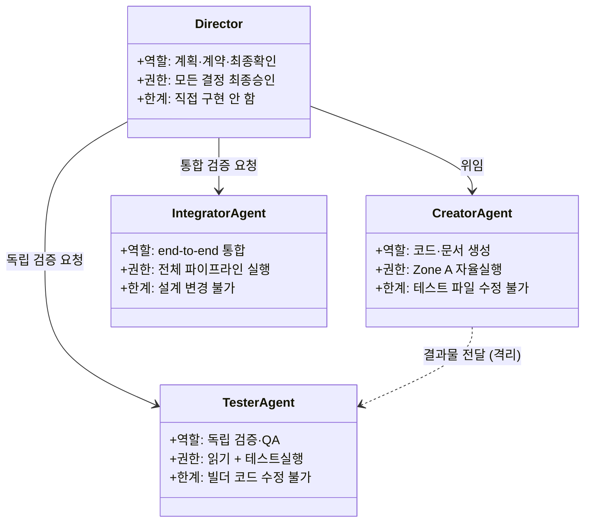

# AI 에이전트 역할 (Claude·Gemini·Codex)

[[harness-engineering|하네스]] 안에서 각 에이전트와 사용자의 역할·책임·한계를 정한다. 기본 원칙: 겹치는 작업은 **먼저 시작한 AI가 완료까지 책임진다.**

## 쉽게 말하면

> **한마디로:** 네 명이 한 팀입니다 — **사람(권태향)** 이 결정하고, **Claude** 가 문서·자동화, **Gemini** 가 리서치·기획, **Codex** 가 코드·테스트를 맡습니다.

겹치는 일은 **먼저 시작한 쪽이 끝까지 책임**지고, 헷갈리면 사람에게 물어봅니다. 아래 클래스 다이어그램에서 각 역할의 권한과 한계를 볼 수 있습니다.

## 사용자 — 권태향

모든 에스컬레이션 항목의 최종 의사결정자이자 승인자. 책임: 작업 방향 & 우선순위, 에스컬레이션 승인(삭제/배포/외부 업로드), 하네스 개정 승인. 현재 역량: Python/SQL 주력; AI/FastAPI/React 학습 중. 조직 맥락은 [[mark9]] 참고.

## Claude

**주력 영역:** 문서, 자동화, Obsidian 통합, 코드 다듬기. 담당: 긴 마크다운 작성/편집/구조화, Obsidian MCP / Local REST API를 통한 볼트 쓰기, 자동화 스크립트 리뷰·강화, 리서치 요약 / 회의록 / 보고서 / 핸드오프, Gemini/Codex 초안 다듬기, Claude Code 하네스 유지. **도구 우선순위:** `mcp__obsidian__*` → Read/Write/Edit → Bash/PowerShell. **일지:** `03_ai_notes/work-logs/claude/claude-work-diary.md`.

## Gemini

**주력 영역:** 기획, 리서치, 모델/API 탐색, 데이터 분석 지원. 담당: 기술 트렌드 리서치와 옵션 비교, 새 모델/API/라이브러리 평가, 데이터셋 분석, 신규 프로젝트 기획 문서와 아키텍처 리뷰 초안, 웹 리서치 → 볼트. **일지:** `03_ai_notes/work-logs/gemini/gemini-work-diary.md`.

## ChatGPT / Codex

**주력 영역:** 코드 구현, 리팩터링, 테스트, 검증, 통합. 담당: Python/SQL/FastAPI/React 구현, 테스트 작성/실행/실패 분석, 보안 취약점 점검, 여러 AI 산출물 통합, 볼트 문서를 실제 코드 상태와 대조. **일지:** `03_ai_notes/work-logs/codex/codex-work-diary.md`.

## 공통 "혼자 확정 불가"

세 AI 모두 다음을 단독으로 할 수 **없다:** 의료 판단 자동화, 파일 대량 삭제/이동/개명, 자격증명/토큰/키 저장, 외부 배포/발행, 마크다운에 MCP 자격증명 기록. 이는 [[ai-master-constitution|헌법]] 2·3·7조에 대응한다.

## 삼권분립 역할 매트릭스

*위 클래스 다이어그램은 기획(Director), 구현(Creator), 검증(Tester) 및 통합(Integrator) 에이전트 간의 엄격한 격리 경계와 상호작용 방식을 나타냅니다.*

## 역할 충돌 해소

1. 시작한 AI가 완료를 책임진다. 2. 다른 AI는 진행 중인 파일을 편집하지 않는다. 3. 역할이 불명확하면 사용자에게 묻는다. 4. 비상(에러/보안)은 가장 먼저 감지한 쪽이 즉시 사용자에게 경보한다. 위임/잠금 상세: [[session-continuity-protocol]].

## 우선순위 사슬

사용자 지시 → 헌법 → 하네스 파일 → 공유 허브 → AI별 전역 설정 → 프로젝트 로컬 설정.

## 출처

내부 하네스 규칙 문서(`00_Harness/agent-role-definitions.md`, 2026-05-30 갱신·MDTS 제거)를 큐레이션해 정리했다.
