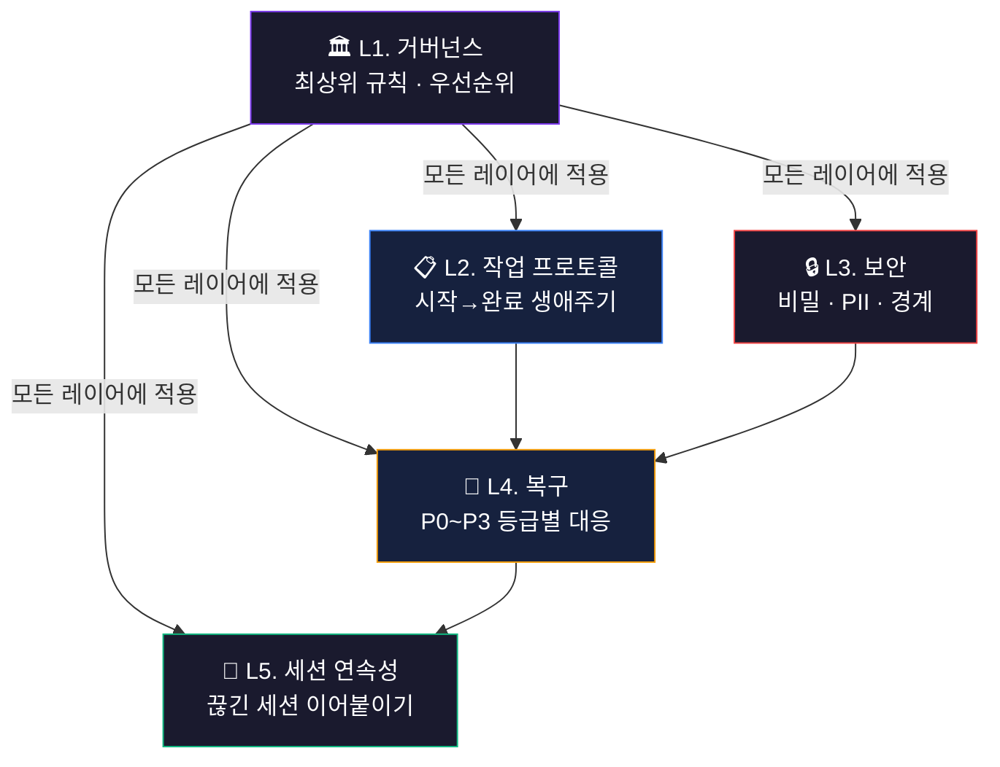

# 하네스 엔지니어링

> **하네스(harness)** 는 모델 자체가 아니라 *모델을 둘러싼 모든 것* — 규칙, 프로토콜, 입력·출력 검증, 도구 권한, 복구 절차 — 을 가리킨다.
> LLM은 똑똑하지만 변덕스럽다. 같은 질문에 다르게 답하고, 시키지 않은 일을 하고, 조용히 실패한다.
> 하네스 엔지니어링은 그 변덕을 **엔지니어링으로 통제**해, LLM을 "재미있는 데모"가 아니라 **반복 가능하고 감사 가능한 일꾼**으로 바꾸는 작업이다.

## 쉽게 말하면

> **한마디로:** **하네스**는 똑똑하지만 변덕스러운 LLM을, 모델 바깥의 **규칙·검증·복구 장치**로 감싸 "믿고 맡길 수 있는 일꾼"으로 바꾸는 작업입니다.

좋은 프롬프트 한 줄로는 부족하고, 아래 다섯 개 층(거버넌스·작업 프로토콜·보안·복구·세션 연속성)으로 통제합니다.

## LLM을 통제하는 엔지니어링

좋은 프롬프트 한 줄로는 부족하다. 신뢰할 수 있는 AI 운영은 다음 5개 층위로 구성된다.

1. **거버넌스** — 무엇이 최우선 규칙이고, 충돌할 때 무엇이 이기는가.
2. **작업 프로토콜** — 한 작업을 시작부터 완료 보고까지 어떻게 진행하는가.
3. **보안** — 비밀·PII·외부 통신을 어떻게 막는가.
4. **복구** — 실패를 어떻게 등급화하고 되돌리는가.
5. **세션 연속성** — 상태 없는(stateless) 세션을 어떻게 이어 붙여 연속된 작업으로 만드는가.

## 하네스 5레이어 구조

*위 다이어그램은 하네스 5레이어 거버넌스 구조를 시각화한 것입니다. 각 레이어는 상위 규칙의 통제 하에 유기적으로 연결되어 작동합니다.*

아래는 실제로 Claude·Gemini·Codex가 Obsidian Vault를 운영하도록 만든 **Harness Engineering v1** 규칙 집합을, 위 5개 주제로 큐레이션한 것이다.

---

## 1. 거버넌스 — 최상위 규칙과 판단

규칙들 사이의 우선순위와 "AI가 스스로 결정해도 되는 경계"를 정한다.

- [[harness-engineering]] — 하네스 거버넌스 시스템 전체 개요(상위 허브 노트)
- [[ai-master-constitution]] — 모든 설정을 덮어쓰는 최상위 8조 헌법(사용자 지시조차 보안·데이터 무결성 조항으로 게이트됨)
- [[agent-decision-rules]] — 자율 실행 vs 사용자 에스컬레이션 기준 + 7단계 충돌 우선순위 사슬
- [[agent-prompt-standards]] — 효과적 프롬프트 5요소와 AI 응답 원칙(TL;DR 우선, 군더더기 금지)

## 2. 작업 프로토콜 — 시작부터 완료까지

한 작업의 생애주기: 부팅 → 검색 → 실행 → 검증 → 완료 보고.

- [[task-execution-protocol]] — 세션 부팅 → RAG 우선 검색 → 실행 → 자가검증 → 보고의 전 과정
- [[task-completion-standards]] — "완료"의 통합 정의: 작업유형별 체크리스트 + 4단계 자가검토 + 완료 보고 형식
- [[quality-control-protocol]] — 원본 품질관리 기준(현재 task-completion-standards에 병합됨)
- [[file-operations-rules]] — 파일 명명·저장 레이아웃·필수 프론트매터·컨텍스트 크기 예산·동기화 정책
- [[agent-workflow-diagram]] — 세션·에스컬레이션·협업·파일 생애주기를 그린 ASCII 흐름도

## 3. 보안 — 비밀과 경계

- [[agent-security-policy]] — 비밀/PII 저장 금지 목록, 보안 코드 패턴, 외부 통신 규칙, P0 비밀 노출 대응

## 4. 복구 — 실패의 등급화와 되돌림

실패를 즉흥 판단이 아니라 영향도 기준으로 처리한다.

- [[failure-recovery-protocol]] — P0~P3 심각도 등급별 복구 절차, 도구 폴백 사슬, 재시도 규칙
- [[failure-recovery-grading]] — (개념) 실패를 고정된 대응으로 매핑하는 P0~P3 심각도 사다리

## 5. 세션 연속성 — 끊긴 세션을 잇기

상태 없는 AI 세션을 연속된 작업으로 만드는 메모리·핸드오프 규약.

- [[session-continuity-protocol]] — 메모리 + 작업일지 + 핸드오프 통합 규칙(크기 제한·컨텍스트 복원·동시편집 잠금)
- [[session-continuity-handoff]] — (개념) 3개 영속 계층 + "재개 지점(resume point)" 핸드오프 컨벤션

## 6. 자기 거버넌스 — 규칙이 규칙을 고치는 법

하네스는 자기 자신의 규칙도 엔지니어링한다.

- [[harness-change-history]] — 하네스 규칙 자체의 추가 전용(append-only) 변경 이력(v1 생성 → 표준화 → 17→14 통합)
- [[change-history-ratchet]] — (개념) 모든 규칙 변경을 기록하고, 삭제 없이 통합하는 자기 거버넌스 래칫

## 7. 실무 도구 — 여러 AI를 부리는 계기판

규칙만이 아니라, 여러 AI를 실제로 동시에 부릴 때 쓰는 운영 도구.

- [[ai-terminal-pane-status]] — 분할 터미널에서 각 패널의 **폴더·작업·작업중 상태**를 한 화면에 보여주는 현황판(Claude 상태줄 + 실시간 상태창, 원클릭 설치)

---

## 계속 자라는 허브

> 이 허브는 **고정된 정답집이 아니다.** 더 좋은 하네스 엔지니어링 — 새로운 평가(eval) 방식, 검증 패턴, 도구 권한 모델, 복구 전략 — 이 검증되면 이 페이지에 노트를 계속 추가한다.
> 규칙은 [[change-history-ratchet|래칫]] 원칙에 따라 **삭제하지 않고 통합**하며, 모든 의미 있는 변경은 [[harness-change-history|변경 이력]]에 남긴다.

<!-- auto-children -->

## 이 분류의 문서

- [[ai-master-constitution|AI 마스터 헌법]]
- [[harness-engineering|하네스 엔지니어링 개요]]
