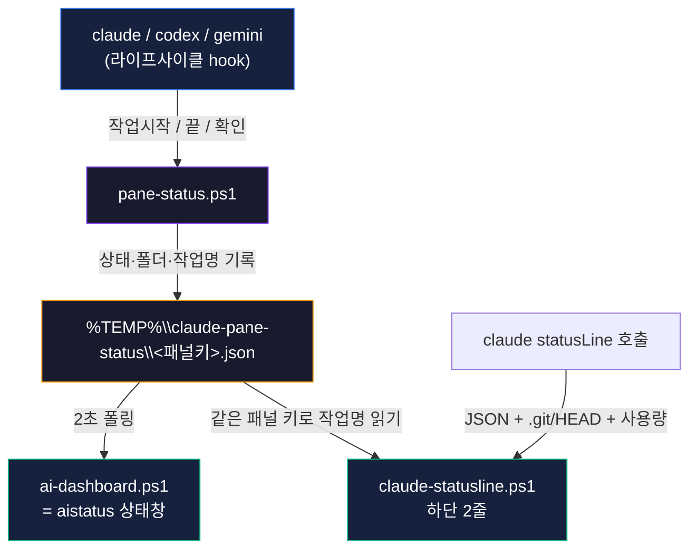

# 분할 터미널 AI 현황판

> [!abstract] 한 줄 요약
> 터미널을 여러 칸으로 쪼개 AI CLI(claude·codex·gemini)를 동시에 돌리다 보면 **"이 칸이 무슨 작업이었지?"** 하고 길을 잃는다. 이 도구는 각 패널 하단에 **폴더·git브랜치·요청작업명**을 붙이고, 모든 세션의 **🟡작업중 / 🟢대기 / 🔴확인** 을 실시간 상태창으로 보여준다. 순수 Windows Terminal에서 동작하고, **단일 파일로 원클릭 설치**된다. 소스 공개: [GitHub](https://github.com/Capernaum-user/ai-terminal-pane-status).

여러 AI를 동시에 부려서 일하다 보면 화면이 금방 복잡해진다. 분할 탭을 여러 개 띄워 놓으면 검은 창들이 다 비슷해서, 어느 칸이 어느 프로젝트이고 무슨 요청을 처리 중인지 헷갈린다. 모델을 더 똑똑하게 만드는 문제가 아니라 **여러 AI를 끝까지 부리는 운영(harness)의 문제**다. 그래서 만들었다.

---

## 무엇이 보이나

### 1) Claude 하단 상태줄 (각 패널 자동)

```text
📁 D:\01_Projects\01_ChannelDock · 🌿 audit-fixes · Opus 4.8 · +12/-3 · 05:21 · ctx 42% · 인증 흐름 리팩…
5h [████░░░░░░] 38% ↻2h13m   7d [█████████░] 86% ↻4d21h
```

- **1줄** — 실행 폴더 절대경로 · git 브랜치 · 모델 · 이번 세션 추가/삭제 라인 · 경과 시간 · 컨텍스트 사용률 · **요청 작업명(최대 12자)**
- **2줄(Pro/Max)** — 5시간·7일 사용량을 **배터리 칸**으로, % 와 **초기화까지 남은 시간**

### 2) 상태창 `aistatus` (분할 한 칸에 / WT는 `Alt+Shift+S`)

```text
 AI 작업 현황    17:23:50    (갱신 2s · Ctrl+C 종료)
 ──────────────────────────────────────────────
  🟡 작업중  claude   방금    01_ChannelDock   ↳ 인증 흐름 리팩터
  🟢 대기    codex    1분전   01_ChannelDock   ↳ 결제 테스트
  🔴 확인!   gemini   방금    03_Guesthouse    ↳ 스키마 리서치
```

> [!tip] 색만 훑으면 끝
> **노란 게 일하는 중, 초록은 내 차례, 빨강은 나를 기다리는 중.** 칸을 일일이 들어가 확인할 필요가 없다. 작업중인 것이 맨 위로 정렬된다.

---

## 설치 (원클릭)

> [!example] 요구사항
> Windows + **Windows Terminal** + **PowerShell 7**(`pwsh`) + **Claude Code**. (선택: Zellij·codex·gemini)

**① 한 줄 설치** (PowerShell 7):
```powershell
$u='https://raw.githubusercontent.com/Capernaum-user/ai-terminal-pane-status/main/Install-AiPaneStatus.ps1'
$f="$env:TEMP\Install-AiPaneStatus.ps1"; irm $u -OutFile $f; pwsh -ExecutionPolicy Bypass -File $f
```

**② 파일 받아서 실행** — 아래 다운로드에서 단일파일 받은 뒤:
```powershell
pwsh -ExecutionPolicy Bypass -File .\Install-AiPaneStatus.ps1
```

옵션: `-AutoStatusPane`(WT 부팅 시 상태창 자동) · `-NoZellij` · `-Uninstall`(되돌리기).

> [!warning] 안전장치
> 기존 `settings.json`(hooks 는 **기존 보존 병합**) · `$PROFILE` · `CLAUDE.md` · Windows Terminal 설정은 모두 **최초 1회 `.bak` 백업 후** 손대고, 여러 번 실행해도 중복·손상이 없다. 경로에 공백이 있어도 안전(따옴표 처리). 되돌리기는 `-Uninstall`.

---

## 기능

| 기능 | 설명 |
|---|---|
| **상태줄** | 각 claude 패널 하단: `📁폴더 · 🌿브랜치 · 모델 · +/-라인 · 시간 · ctx% · 요청작업명(12자)` |
| **사용량 배터리** | Pro/Max: 5시간·7일 한도를 칸 막대 + 초기화까지 남은 시간 |
| **상태창 `aistatus`** | 모든 AI 세션의 🟡작업중/🟢대기/🔴확인 실시간 표 (2초 폴링) |
| **AI 자동 라벨** | 작업 시작 시 AI가 작업명을 스스로 기록(`label "..."`로 수동 변경) |
| **Windows Terminal 통합** | `Alt+Shift+S` 상태창 분할, `-AutoStatusPane`로 부팅 자동 |
| **Zellij(선택)** | `zwork`로 4분할 + 패널 프레임 색 라벨 |
| **세 도구 지원** | claude·codex·gemini 모두 같은 상태창에 표시 |

---

## 동작 원리



> [!note] 같은 패널을 어떻게 묶나
> 같은 패널의 모든 프로세스(claude·상태줄·hook·AI의 도구 호출)는 Windows Terminal이 패널마다 부여하는 `WT_SESSION` 환경변수를 공유한다. 이걸 레코드 키로 써서, AI가 기록한 작업명을 상태줄이 정확히 같은 패널에서 읽는다. (Zellij면 `ZELLIJ_PANE_ID`.)

> [!note] 작업중을 왜 상태창이 담당하나
> Claude 상태줄은 **claude가 쉴 때만** 다시 그려지므로 거기서 실시간 "작업중"을 잡기 어렵다. 그래서 상태줄은 폴더·작업명·끝남 신호를, **실시간 작업중/대기는 별도 폴링 상태창(`aistatus`)** 이 담당한다.

---

## 사용법

```powershell
aistatus            # 상태창 (Ctrl+C 종료) — WT는 Alt+Shift+S
wshelp              # 전체 명령 도움말
label "결제 버그"    # 이 패널 작업명 수동 지정
zwork channeldock   # (Zellij) 4분할 색 라벨
```

> [!tip] codex · gemini 도 함께
> 같은 상태 스크립트를 재사용한다. codex는 `~/.codex/config.toml`에 hook 추가 후 `/hooks`로 신뢰 승인 1회, gemini는 `~/.gemini/settings.json`에 hook 추가 후 재시작하면 같은 상태창에 함께 뜬다. (저장소 `installer/README.md` 참고.)

---

## 다운로드 & 소스

- 📦 **단일 설치파일**: [Install-AiPaneStatus.ps1](Install-AiPaneStatus.ps1) (또는 [GitHub raw](https://raw.githubusercontent.com/Capernaum-user/ai-terminal-pane-status/main/Install-AiPaneStatus.ps1))
- 🗜 **번들 zip**: [terminal-pane-status-installer.zip](terminal-pane-status-installer.zip)
- 💻 **소스 / 이슈**: [github.com/Capernaum-user/ai-terminal-pane-status](https://github.com/Capernaum-user/ai-terminal-pane-status) · MIT 라이선스

---

> [!success] 정리
> 분할 터미널이 많아도 — 상태줄에 **폴더·작업명**이, 상태창에 **🟡작업중/🟢대기/🔴확인**이. 설치는 단일파일 원클릭, 순수 Windows Terminal에서 동작, AI가 작업명을 스스로 적는다.

> 함께 보기: [[harness-engineering|하네스 엔지니어링 개요]]
