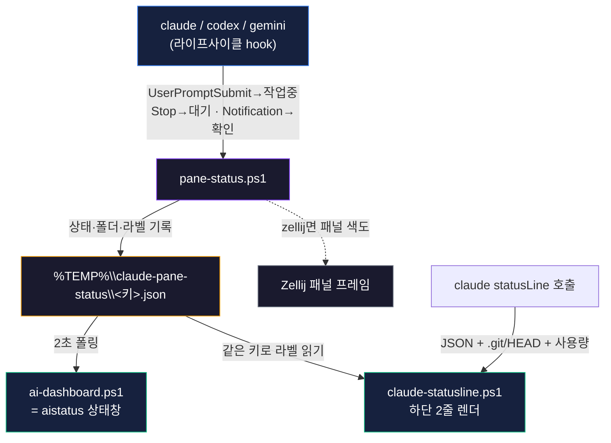

# 분할 터미널 AI 현황판

> [!abstract] 한 줄 요약
> 터미널을 여러 칸으로 쪼개 AI CLI(claude·codex·gemini)를 동시에 돌리다 보면 **"이 칸이 무슨 작업이었지?"** 하고 길을 잃는다. 이 도구는 각 패널에 **폴더 절대경로 · git 브랜치 · 모델 · 작업 라벨**을 붙이고, **🟡작업중 / 🟢대기 / 🔴확인** 상태를 자동으로 표시한다. 순수 Windows Terminal에서 동작하고, 원클릭으로 설치된다.

여러 AI를 동시에 부려서 일하다 보면 화면이 금방 복잡해진다. 4분할 탭을 여러 개 띄워 놓으면 검은 창들이 다 비슷해서, 어느 칸이 어느 프로젝트이고 무슨 요청을 처리 중인지 헷갈린다. 모델을 더 똑똑하게 만드는 문제가 아니라 **여러 AI를 끝까지 부리는 운영(harness)의 문제**다. 그래서 만들었다.

---

## 무엇이 보이나

### 1) Claude 하단 상태줄 (패널마다 항상)

`claude`를 실행하면 그 패널 맨 아래에 두 줄이 뜬다.

```text
📁 D:\01_Projects\01_ChannelDock · 🌿 audit-fixes · Opus 4.8 · +12/-3 · 05:21 · ctx 42% · 🤖 인증 흐름 리팩터
5h [████░░░░░░] 38% ↻2h13m   7d [█████████░] 86% ↻4d21h
```

- **1줄** — 실행 폴더 **절대경로** · git 브랜치 · 모델 · 이번 세션 추가/삭제 라인 · 경과 시간 · 컨텍스트 사용률 · **🤖 작업 라벨**
- **2줄(Pro/Max)** — 5시간·7일 사용량을 **배터리 칸**으로(`▮`=사용), % 와 **초기화까지 남은 시간**까지. 한도에 가까우면 빨강.

### 2) 상태창 `aistatus` (분할 한 칸에 띄워둠)

```text
 AI 작업 현황    17:23:50    (갱신 2s · Ctrl+C 종료)
 ──────────────────────────────────────────────
  🟡 작업중  claude   방금   01_ChannelDock   ↳ 인증 흐름 리팩터
  🟢 대기    codex    1분전  01_ChannelDock   ↳ 결제 테스트
  🔴 확인!   gemini   방금   03_Guesthouse    ↳ 스키마 리서치
  🟢 대기    claude   2분전  13_quartz-site
```

> [!tip] 색만 훑으면 끝
> 고개 들어 **노란 게 일하는 중, 초록은 내 차례, 빨강은 나를 기다리는 중.** 칸을 일일이 들어가 확인할 필요가 없다. 작업중인 것이 맨 위로 정렬된다.

### 3) 작업 라벨은 AI가 스스로 짓는다

작업을 요청하면 AI가 그 작업을 짧게 요약한 라벨(`🤖 인증 흐름 리팩터`)을 패널에 붙인다. 직접 바꾸고 싶으면 `label "결제 버그 추적"`.

---

## 동작 원리



핵심은 세 가지 설계 결정이다.

> [!note] 왜 hook이 파일에 기록하고, 상태창이 따로 읽나
> AI의 hook은 **자기 터미널 화면에 직접 못 그린다**(출력이 캡처됨). 그래서 hook은 상태를 **파일에 기록**만 하고, 별도 프로세스인 상태창이 그 파일을 폴링해 그린다. 이게 순수 Windows Terminal에서 작업중/대기를 보여주는 유일하게 신뢰성 있는 방법이다.

> [!note] 왜 "작업중"을 상태줄이 아니라 상태창에 두나
> Claude 상태줄은 **claude가 쉴 때만** 다시 그려진다. 생성 중에는 갱신되지 않으니, 거기에 "작업중"을 넣으면 항상 초록으로만 보이는 함정이 된다. 그래서 실시간 상태는 **상태창**이 담당한다.

> [!note] 같은 패널을 어떻게 묶나 (WT_SESSION)
> 같은 패널의 모든 프로세스(claude·상태줄·hook·AI의 도구 호출)는 Windows Terminal이 패널마다 부여하는 `WT_SESSION` 환경변수를 공유한다. 이걸 레코드 키로 써서, AI가 기록한 라벨을 상태줄이 정확히 같은 패널에서 읽는다. (Zellij면 `ZELLIJ_PANE_ID`.)

---

## 설치 (원클릭)

> [!example] 요구사항
> Windows + **Windows Terminal** + **PowerShell 7**(`pwsh`) + **Claude Code**. (선택: Zellij·codex·gemini)

설치 번들을 받아 PowerShell 7로 한 줄 실행한다.

```powershell
# 번들 압축을 푼 폴더에서
pwsh -ExecutionPolicy Bypass -File .\install.ps1
```

- 📦 **[설치 번들 다운로드 (zip)](terminal-pane-status-installer.zip)**
- 기존 `settings.json` / `$PROFILE` / `CLAUDE.md` 는 **`.bak` 백업 후 병합**(덮어쓰기 아님), 경로의 사용자명은 **자동 적응**.
- 되돌리기: `install.ps1 -Uninstall` · Zellij 건너뛰기: `-NoZellij`

설치되는 것: `~\.local\bin\pane-workspace.ps1`(명령), `~\.claude\hooks\`의 상태 스크립트 3종, `settings.json`의 hooks+statusLine, `CLAUDE.md`의 AI 자동 라벨 규칙.

---

## 사용법

| 명령 | 하는 일 |
|---|---|
| `claude` 실행 | 그 패널 하단에 상태줄 자동(폴더·브랜치·모델·라벨·사용량) |
| `aistatus` | 모든 AI 세션의 작업중/대기/확인 실시간 표 (분할 한 칸에 띄워둠) |
| `label "결제 버그"` | 이 패널 작업 라벨 수동 지정 (평소엔 AI가 자동) |
| `zwork <프로젝트>` | (Zellij) 4분할 + 패널 프레임 색 라벨 |
| `wshelp` | 전체 명령 도움말 |

> [!tip] codex · gemini 도 함께
> 같은 상태 스크립트를 재사용한다. codex는 `~\.codex\config.toml`에 hook을 넣고 새 세션에서 `/hooks`로 신뢰 승인 1회, gemini는 `~\.gemini\settings.json`에 hook을 넣고 재시작하면 상태창에 함께 뜬다. (번들 README의 '선택' 절 참고.)

---

## 왜 이게 "하네스"인가

좋은 모델 하나로는 부족하다. 여러 AI를 동시에, 끝까지, 헷갈리지 않고 부리려면 **운영을 위한 계기판**이 필요하다. 이 도구는 그 계기판이다 — 어느 칸이 무슨 일을 하고 있고, 누가 나를 기다리는지, 한도는 얼마나 남았는지를 한 화면에 모은다. 모델을 똑똑하게 만드는 대신, **사람이 여러 AI를 신뢰 있게 지휘**하게 만든다.

> [!success] 정리
> 분할 터미널이 많아도 — **색만 훑으면** 어디가 일하고 어디가 내 차례인지 보인다. 설치는 원클릭, 순수 Windows Terminal에서 동작, AI가 라벨을 스스로 짓는다.

> 함께 보기: [[harness-engineering|하네스 엔지니어링 개요]] · [[session-continuity-protocol|세션 연속성]]
