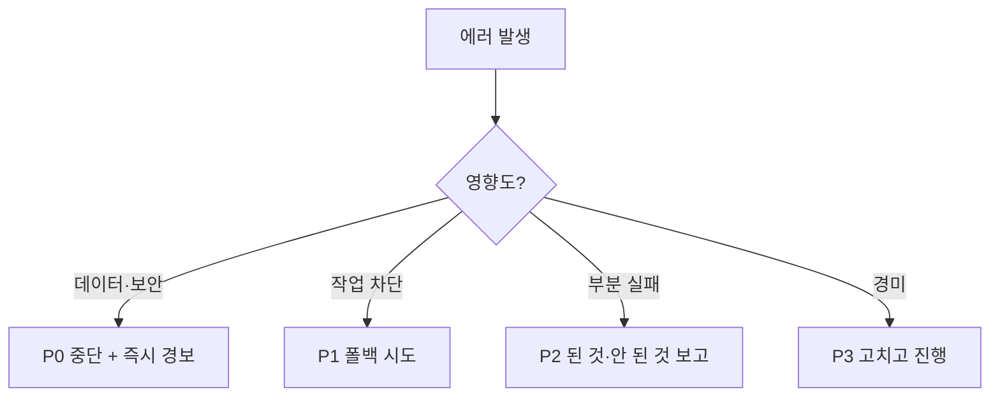

# 실패 복구 등급화

하네스는 실패를 이분법이 아니라 등급화된 변수로 다룬다. 하나의 P0~P3 심각도 사다리가 각 실패 유형을 미리 정해진 대응으로 매핑하므로, 반응이 즉흥이 아니라 **영향도**로 결정된다. 상세 절차는 [[failure-recovery-protocol]].

## 쉽게 말하면

> **한마디로:** 에러가 났을 때 **즉흥적으로 반응하지 않도록**, 실패를 영향도에 따라 P0~P3 네 칸으로 나눠 미리 정한 대응에 연결합니다.

데이터·보안 사고(P0)는 무조건 멈추고 경보, 경미한 문제(P3)는 고치고 계속 갑니다.

## 사다리

| 등급 | 트리거 | 반사 행동 |
|---|---|---|
| P0 | 데이터 손실 / 보안 침해 | 모든 작업 중단, 즉시 경보 |
| P1 | 작업 완전 차단 | 폴백 시도, 안 되면 경보 |
| P2 | 부분 실패 | 된 것 보고, 안 된 것 나열 |
| P3 | 경미 | 고치고 계속 진행 |

## 왜 사다리인가

같은 심각도 어휘(P0~P3 / CRITICAL~LOW)가 하네스 곳곳에서 반복된다 — 실패 복구, [[task-completion-standards|코드 리뷰 등급]], 보안 P0 대응 — 덕분에 에이전트가 하나의 일관된 트리아지 언어를 갖는다. 사다리 꼭대기는 [[ai-master-constitution|헌법]]이 가장 보호하는 두 가지 비가역 항목, 즉 데이터 무결성과 보안에 예약되어 있다. 둘 다 [[agent-security-policy|보안 정책]]과 "중단 + 경보" 반사를 공유한다.

## 제한된 재시도

복구는 의도적으로 보수적이다. 네트워크/락 에러는 1회 재시도, 권한·보안 에러는 재시도하지 않고 에스컬레이션한다. 무한 sleep-재시도 루프는 금지다. 이는 에이전트가 실패를 고치려다 오히려 증폭시키는 것을 막는다.

## 관련

- [[failure-recovery-protocol]] · [[agent-security-policy]] · [[task-completion-standards]]

## 출처

내부 하네스 규칙 문서(`00_Harness/failure-recovery-protocol.md`, `agent-security-policy.md`)를 큐레이션해 정리했다.
