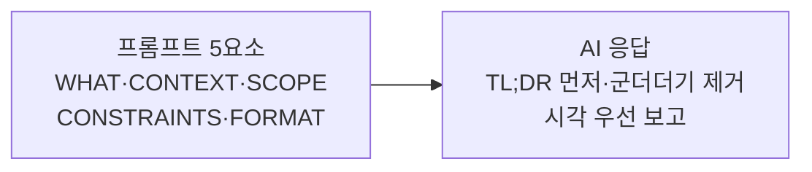

# 에이전트 프롬프트 표준

사용자가 AI에게 효과적으로 지시하는 법과, AI가 그 지시를 해석·응답하는 방식.

## 쉽게 말하면

> **한마디로:** 잘 시키는 법과 잘 답하는 법의 약속입니다. 사용자는 **5요소**(무엇·왜·어디·하지 말 것·출력형태)로 지시하고, AI는 **결론(TL;DR)을 먼저** 말하고 군더더기·공감 멘트를 뺍니다.

## 좋은 프롬프트의 5요소

WHAT(목표), CONTEXT(이유/상황), SCOPE(어디/어떤 파일·부분), CONSTRAINTS(하지 말 것·지킬 것), FORMAT(출력 형태). 원문은 이 뼈대를 따르는 작업별 템플릿(코드 작성, 버그 수정, 볼트 문서, 리서치, 핸드오프 요청)을 제공한다.

## 시각 우선 보고

사용자에게 보여 줄 핵심 산출물은 **Excalidraw**(`.excalidraw.md`)로 시각화한다 — 아키텍처, 데이터 흐름, 로드맵, 비교표, AI 협업 워크플로우, 의사결정 트리, 진행 요약 등. 중요 노드에는 Obsidian `[[링크]]`를 달고, AI는 `.excalidraw.md`의 JSON을 직접 편집할 수 있다.

## AI 응답 원칙 (모든 AI 공통)

1. 감정·공감·"좋은 질문이에요" 같은 서두를 제거한다. 2. TL;DR(결론)을 먼저 쓴다. 3. 불확실한 것은 "확인 필요"로 표시하고, 단정적 추측을 하지 않는다. 4. 얼버무리는 표현("~하시면 될 것 같습니다")을 단정형으로 바꾼다. 5. "도움이 되었길 바랍니다" 같은 마무리를 뺀다. 6. 미완성 항목을 완성으로 보고하지 않는다(헌법 4조와 동일 취지).

## 컨텍스트 윈도우 효율

핵심 파일만 읽고, 큰 파일은 부분만(offset/limit) 읽는다. 첫 검색 결과를 재활용하고, 다시 읽지 않으며, 끝난 항목은 메모리·작업일지로 외부화한다.

## 세션 내 지시 우선순위

가장 최근 지시가 이긴다. 명시 > 암시, 구체 > 일반, 모호하면 가정을 밝히고 진행하거나 묻는다.

## 금지된 응답 패턴

같은 내용 반복; "이렇게 할까요?"를 반복하는 확인; 완료 후 불필요한 설명; 이미 읽기 쉬운 코드를 다시 설명하는 긴 주석; 요청하지 않은 기능·제안을 본문에 섞는 것(보고 뒤에 따로 언급).

## 한국어 / 영어 사용

한국어: 사용자용 설명·보고, 작업일지, 핸드오프, 사람이 읽는 볼트 문서. 영어: 코드/식별자, CLI/경로/API 이름, 원본 에러 메시지(한국어 풀이 병기), 또는 사용자가 영어 산출물을 요청할 때.

## 출처

내부 하네스 규칙 문서(`00_Harness/agent-prompt-standards.md`)를 큐레이션해 정리했다.
