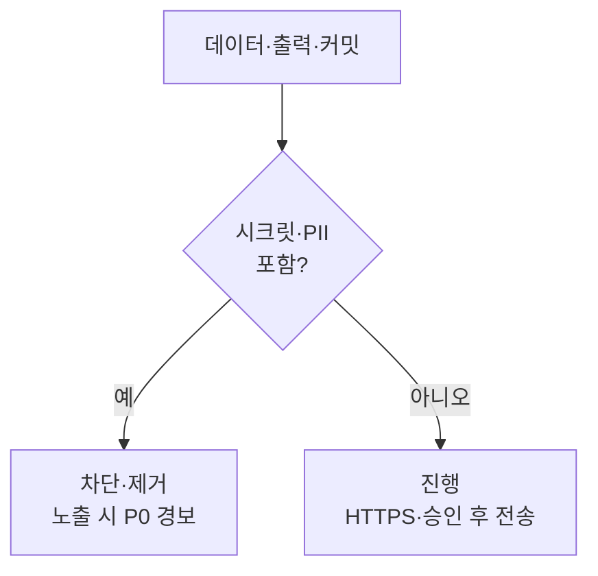

# 에이전트 보안 정책

[[ai-master-constitution|헌법]] 2조를 상세 구현한 문서다. (원본은 제목이 빨간색인 시각 경고 문서다.)

## 쉽게 말하면

> **한마디로:** 헌법 2조(보안)를 실제 규칙으로 풀어낸 문서입니다. **시크릿·개인정보는 어디에도 저장하지 않고**, 안전한 코드 패턴을 쓰며, 외부 전송은 승인 후 HTTPS로만 합니다.

혹시 시크릿이 새면 즉시 멈추고 **P0 경보 → 폐기/교체**로 대응합니다.

## 절대 저장 금지 (마크다운·코드·주석·로그 어디에도)

API 키/시크릿, OAuth/refresh/access 토큰, 비밀번호/패스프레이즈, 개인키(RSA/EC/SSH), 쿠키/세션 토큰, 주민등록번호·여권번호·운전면허번호, Mark9 직원/고객의 전화·이메일, 실명·생년월일(비식별화 전), 카드/계좌번호, Mark9 내부 IP/도메인/서버 정보(공개 승인 전).

## 안전한 코드 패턴

- **SQL** — 파라미터화 쿼리만 사용. 사용자 입력을 f-string으로 끼워 넣지 않는다.
- **경로 탐색(path traversal)** — `os.path.realpath`로 정규화하고, 결과가 기준 디렉터리 아래에 남는지 검증한다.
- **시크릿** — 환경변수(`os.environ.get`)에서 읽고 하드코딩하지 않으며, 없으면 예외를 발생시킨다.
- **의존성** — 버전 고정, 최신 안정판, 알려진 취약 버전 금지, 불필요한 패키지 금지.

## 파일 시스템 & 외부 통신

- 파일 작업 전 경로를 검증하고, 심볼릭 링크 악용을 피하며(realpath), 임시 파일을 정리하고, `777` 권한을 주지 않으며, 민감 파일을 볼트 밖에 저장하지 않는다.
- HTTPS만 사용한다. 인증서 검증을 끄지 않는다(`verify=False` 금지). 외부 전송 전 PII를 점검하고, 사용자 승인 없이 외부 API로 전송하지 않으며, API 응답 본문 전체를 로깅하지 않는다.

## Mark9 기밀

Mark9 시크릿은 볼트 내부에서만 처리하고 `23_Mark9/`에만 저장한다. Mark9 직원 정보·사업계획·미공개 기술을 볼트 밖으로 업로드하지 않으며, AI 응답에 Mark9 기밀을 포함하지 않는다. 기밀 기준: `23_Mark9/company-confidential-profile.md`. [[mark9]] 참고.

## 의료 데이터 (향후 프로젝트)

MDTS는 종료되었다(2026-05-29). 향후 의료 작업: 보조 정보만 제공하고, 진단/처방을 최종 확정하지 않으며, 환자 데이터에 PII를 두지 않고(비식별화), 외부 AI API로 전송하지 않는다(로컬 추론만).

## 시크릿 노출 대응 (P0)

즉시 중단 → 범위 파악 → 사용자에게 P0 경보 → 노출되었다면 폐기/교체(revoke/rotation) 안내 → 마크다운에서 제거 → git 히스토리에 있으면 `git-filter-repo` 안내 → 작업일지에 재발 방지를 기록. [[failure-recovery-protocol]] 및 [[failure-recovery-grading]]와 연결된다.

## .gitignore 권장

항상 포함: `.env`, `.env.*`, `*.key`, `*.pem`, `*.p12`, `*.pfx`, `secrets/`, `credentials/`, `__pycache__/`, `*.pyc`, `.DS_Store`.

## 출처

내부 하네스 규칙 문서(`00_Harness/agent-security-policy.md`)를 큐레이션해 정리했다.
