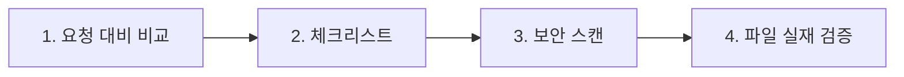

# 품질 관리 프로토콜

본래 독립 품질관리(QC) 문서다. 2026-05-30에 (수용 기준·리뷰 체크리스트와 함께) [[task-completion-standards]]로 **병합**되었으며, 이 페이지는 하네스 인덱스가 이력을 위해 보존한 원본을 정리한 것이다.

## 쉽게 말하면

> **한마디로:** "완료"라고 말하기 전에 통과해야 하는 **품질 검사 기준**입니다. (지금은 [[task-completion-standards|작업 완료 표준]]에 합쳐졌고, 이 문서는 이력 보존용 원본입니다.)

핵심은 보고 전에 거치는 **4단계 자가검토**입니다.

## 코드 품질 기준

- **필수(모든 코드):** 실행 가능(문법 오류 없음), 요청 기능 구현, 타입 힌트(Python), 예외 처리, 보안(SQL 인젝션 / 경로 탐색 / 하드코딩 시크릿 없음 — [[agent-security-policy]] 참고), 단일 책임.
- **권장(복잡한 코드):** 복잡도 주석(O 표기, 핫패스), 자명하지 않은 공개 API의 docstring, 로그로 관찰 가능, 의존성 선언.
- **금지:** `...` 생략, 하드코딩 경로/IP/포트, 커밋 제외 파일 속 시크릿, 운영 코드에 남은 `print()` 디버그.

## 문서 품질 기준

구조: `descriptive-title.md`, 필수 프론트매터 6개 필드 전부, 올바른 위치, 존재하는 파일로만 링크, 허용 목록의 `type`, YYYY-MM-DD 날짜. 내용: TL;DR/요약 먼저, 불확실성 "확인 필요" 표시, 출처 인용, 키/PII 없음. 언어: 사람이 읽는 텍스트는 한국어, 코드/경로/API 이름은 영어, 기술 용어는 혼용.

## 4단계 자가검토

1. 요청 대비 출력 비교. 2. 체크리스트 통과(실패 기록). 3. 보안 스캔. 4. 파일이 기대한 내용으로 실제 존재하는지 검증.

## 코드 리뷰 심각도

CRITICAL(보안/데이터 손실 → 수정 + 경보), HIGH(실행 불가 → 수정), MEDIUM(성능/유지보수성 → 권고), LOW(스타일 → 선택).

## 문서 리뷰 & 회귀 방지

문서 리뷰 점검: 파일명, 프론트매터, 위치, 정확성, 보안, 링크 유효성. 편집 후 주변 코드를 확인하고, 영향받는 파일을 점검하고, 인터페이스(시그니처/엔드포인트) 변경을 보고하며, 기존 테스트가 있으면 실행한다.

## 출처

내부 하네스 규칙 문서(`00_Harness/quality-control-protocol.md`, 2026-05-30 task-completion-standards로 대체됨)를 큐레이션해 정리했다.
