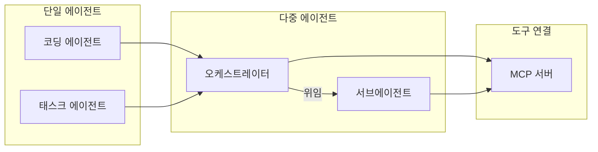

# AI 에이전트

> **근성쌤 · AI 지식허브**의 주력 주제 중 하나. 사람이 일일이 손대지 않아도 코드·문서·작업이 굴러가게 만드는 **AI 에이전트**를, 이론이 아니라 실제 운영 기록으로 정리한다.

## 이 허브는 무엇인가

AI 에이전트는 "프롬프트 한 번"이 아니라 **스스로 도구를 쓰고, 일을 나누고, 검증하며 끝까지 처리하는 실행 시스템**이다. 이 허브는 단일 코딩 에이전트부터 여러 에이전트를 묶는 오케스트레이션, 외부 도구를 잇는 MCP까지, 직접 굴려 본 구조와 규칙을 공개 기록으로 남긴다.

## 에이전트 구조 및 유형

*위 다이어그램은 단일 에이전트, 다중 에이전트 오케스트레이션, 그리고 MCP(Model Context Protocol) 도구 연결의 위계 구조를 나타냅니다.*

## 하위 노트

- [[agent-catalog|에이전트 카탈로그]] — 코딩 에이전트·서브에이전트·오케스트레이터·MCP가 각각 무엇이고 어떻게·왜 쓰는지 한 장 정리
- [[ai-agent-roles|AI 에이전트 역할 (Claude·Gemini·Codex)]] — 사람과 각 AI의 역할·책임·한계, 역할 충돌 해소와 우선순위
- [[agent-decision-escalation|에이전트 의사결정과 에스컬레이션]] — 자율 실행 vs 사람 확인을 가르는 2구역 모델과 '엄격한 규칙이 이긴다' 우선순위 체계

## 왜 중요한가

- **신뢰의 근거.** 에이전트를 어떻게 설계·통제하는지를 공개하면, 막연한 "AI 잘함"이 아니라 **검증 가능한 전문성**으로 보인다.
- **안전이 먼저.** 여러 자율 에이전트를 한 파일시스템 위에서 굴리려면, "알아서 판단"을 명시적·감사 가능한 게이트로 바꿔야 한다. 그 핵심이 [[agent-decision-escalation|에스컬레이션]] 규칙이다.
- **재현 가능성.** 역할 분리(계획/구현/검증)와 DAG 기반 오케스트레이션은 일회성 마법이 아니라 반복 가능한 작업 틀을 만든다.

## 관련 허브

- [[harness-engineering|하네스 엔지니어링]] — 에이전트를 안전하게 운영하는 거버넌스 토대
