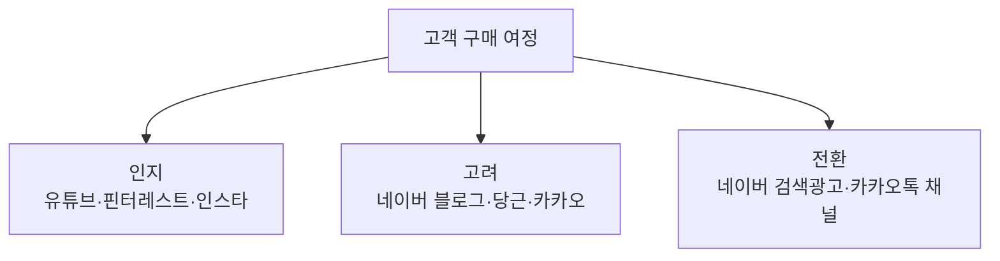

# 광고매체 카탈로그

> 인스타그램이 메인 무대지만, **고객의 구매 여정은 여러 채널에 걸쳐 있습니다.** 검색으로 알아보고, 지역 채널에서 신뢰를 확인하고, 메신저로 문의합니다. 이 노트는 인스타 외 매체를 REUEL MASION의 적합도 기준으로 한눈에 비교하기 위한 카탈로그입니다.

## 쉽게 말하면

> **한마디로:** 인스타가 메인이지만 고객은 **여러 채널을 거쳐** 옵니다. 이 노트는 인스타 밖 광고 채널을 우리 사업에 맞는지 기준으로 한눈에 비교한 카탈로그입니다.

채널은 고객 여정의 어느 단계(인지 → 고려 → 전환)에 강한지로 배치합니다.

## 매체를 보는 4가지 축

각 매체는 아래 축으로 판단합니다.

- **의도(Intent)**: 사용자가 "필요해서 찾는" 검색형인가, "둘러보다 발견하는" 노출형인가.
- **단계(Funnel)**: 인지(처음 알림) / 고려(비교) / 전환(문의·예약)에서 어디에 강한가.
- **비용 감각(Cost)**: 진입 비용과 과금 방식(클릭·노출·기간·수수료).
- **사업 적합도(Fit)**: 인테리어·감성·지역 기반 서비스에 잘 맞는가.

## 매체 비교표

| 매체 | 의도 | 강한 단계 | 비용 감각 | 인테리어 적합도 | 핵심 활용 포인트 |
|---|---|---|---|---|---|
| 네이버 검색광고(파워링크) | 검색형(높음) | 전환 | 클릭당 과금, 키워드 경쟁가 변동 | 높음 | "지역+인테리어", "원룸 인테리어" 등 구매 직전 키워드 |
| 네이버 블로그/플레이스 | 검색형 | 고려·전환 | 시간 투자형(자연), 플레이스 광고 별도 | 매우 높음 | 시공 후기·포트폴리오 축적, 지역 검색 노출, 지도 노출 |
| 카카오(모먼트·비즈보드) | 노출형 | 인지·고려 | 노출/클릭 과금, 대형 도달 | 중간 | 톡 채널로 상담 연결, 리타겟팅 |
| 카카오톡 채널 | 응답형 | 전환 | 운영 비용 낮음, 메시지 발송비 | 높음 | 문의 응대·예약·쿠폰, 단골 재방문 |
| 유튜브 | 노출+검색 | 인지·고려 | 제작비 높음, CPV 광고 | 높음(롱폼·쇼츠) | before/after 과정 영상, 시공 신뢰 구축, 쇼츠로 도달 |
| 당근(지역광고) | 지역형 | 고려·전환 | 지역 단위 저비용 | 매우 높음(지역 시공) | 동네 단위 시공·홈스타일링 문의, 신뢰 기반 |
| 핀터레스트 | 발견형 | 인지·고려 | 자연 유입 강함 | 높음(레퍼런스) | 무드보드·스타일 검색 유입, 장기 트래픽 |
| 구글 검색·GBP | 검색형 | 전환 | 클릭당 과금 | 중간(국내는 네이버 우세) | 영문/외국인 고객, 지도(비즈니스 프로필) |
| 오프라인(전단·지역지·현수막) | 노출형 | 인지 | 기간·제작 고정비 | 중간(지역 한정) | 신축·재건축 단지, 상가 밀집지 타겟 |
| 인테리어 플랫폼(오늘의집·집닥 등) | 의도형 | 고려·전환 | 입점·중개 수수료 | 매우 높음 | 시공 의뢰 매칭, 포트폴리오 노출 |
| 제휴/협업(인플루언서·브랜드) | 노출+신뢰 | 인지·고려 | 단가 협의, 제품 협찬 | 높음 | 감성 브랜드 핏, 신뢰 이전 효과 |

## 적합도 빠른 판단

- **지역 시공·홈스타일링이 메인이면** → 네이버 블로그/플레이스 + 당근 + 네이버 검색광고를 우선한다(구매 직전 의도 + 지역 신뢰).
- **브랜드·감성 인지를 키우려면** → 인스타 + 유튜브 쇼츠 + 핀터레스트로 발견 트래픽을 쌓는다.
- **문의를 닫는(전환) 단계는** → 카카오톡 채널로 응대 동선을 통일한다(흩어진 DM을 한 곳으로).
- **시공 의뢰 자체를 늘리려면** → 인테리어 플랫폼 입점 비용 대비 매칭 효율을 분기마다 점검한다.

## 채널 조합 예시 (스타터)

| 목표 | 매체 조합 | 의도 |
|---|---|---|
| 지역 시공 문의 확보 | 네이버 플레이스 + 당근 + 파워링크 | 의도 높은 트래픽을 지역으로 |
| 브랜드 감성 인지 | 인스타 릴스 + 유튜브 쇼츠 + 핀터레스트 | 발견·저장으로 도달 확장 |
| 문의→예약 전환 | 카카오톡 채널 + 예약폼 | 문의 동선 단일화 |

## 운영 메모

- **하나씩 측정**: 채널을 동시에 다 켜지 말고, 한 번에 1~2개를 도입해 문의 출처를 구분한다.
- **출처 추적**: "어디 보고 오셨어요?"를 첫 응대에 넣어 채널별 효율을 기록한다.
- **수치 재확인**: 키워드 단가·CPV·수수료율은 시점 변동이 크다. 예산 집행 전 당일 견적으로 갱신한다.
- **보안**: 광고 계정 로그인·결제 정보·API 토큰은 이 위키에 저장하지 않는다.

## 관련 노트

- [[instagram-growth-playbook|인스타 성장 플레이북]] — 메인 채널 인스타의 도달·전환 전략.
- [[instagram-influencer-watch|인스타 인플루언서 관찰]] — 제휴·협업 매체의 후보 발굴.
