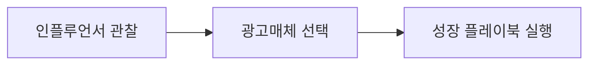

# 회사 인텔 · REUEL MASION

> **REUEL MASION**은 인테리어 디자인과 인스타그램 인플루언서 활동을 함께 운영하는 회사입니다. 이 허브는 회사의 마케팅 판단에 필요한 **시장 정보를 모으고 정리하는 곳**입니다. 예쁜 레퍼런스 수집이 아니라, "그래서 우리가 무엇을 따라 하고 무엇을 피할지"를 결정하기 위한 실용 인텔에 집중합니다.

## 쉽게 말하면

> **한마디로:** REUEL MASION이 "무엇을 따라 하고 무엇을 피할지"를 정하기 위해 **시장 정보를 모아 두는 곳**입니다. 예쁜 레퍼런스 수집이 아니라 의사결정용 인텔입니다.

쓰는 순서가 정해져 있습니다 — 먼저 **누구를 벤치마크할지 관찰**하고, **어느 채널에 돈을 쓸지 고르고**, **콘텐츠로 실행**합니다.

## 무엇을 모으는 곳인가

이 허브는 세 갈래의 시장 정보를 다룹니다.

- **인플루언서 관찰(Influencer Watch)** — 인테리어·감성 분야에서 누가, 어떤 포맷으로, 어떻게 전환을 만드는지 발굴하고 추적한다.
- **광고매체 카탈로그(Ad Media Catalog)** — 인스타그램 외의 광고 채널(네이버·카카오·유튜브·당근·검색·오프라인 등)을 우리 사업 적합도 기준으로 비교한다.
- **성장 플레이북(Growth Playbook)** — 사람들이 우리 인스타를 더 보게 만드는 실전 전략(콘텐츠 포맷·해시태그·릴스·협업)을 정리한다.

## 허브 노트

- [[instagram-influencer-watch|인스타 인플루언서 관찰]] — 인테리어/감성 분야 인플루언서를 발굴·추적하는 방법과 관찰 기준(분류·점수표·추적 템플릿).
- [[ad-media-catalog|광고매체 카탈로그]] — 인스타 외 광고매체의 특징·비용 감각·적합도 비교표.
- [[instagram-growth-playbook|인스타 성장 플레이북]] — 도달과 저장을 늘리는 콘텐츠·해시태그·릴스·협업 전략.

## 운영 원칙

- **목적은 의사결정**: 모든 노트는 "이걸 보고 무엇을 할지"가 분명해야 한다. 단순 목록은 인텔이 아니다.
- **벤치마크는 모방이 아니다**: 잘 되는 계정에서 *구조*(포맷·훅·전환 장치)를 배우되, 이미지·캡션·도면 원문을 무단 복제·재게시하지 않는다.
- **수치는 재확인**: 팔로워·조회수·단가 같은 수치는 변동이 크므로, 제안서나 광고비 추정에 쓰기 전 당일 값으로 다시 확인한다.
- **프리미엄 톤, 실용 정보**: REUEL MASION의 결은 프리미엄을 지향하되, 콘텐츠는 과장 없이 근거 있는 정보 중심으로 균형을 잡는다.
- **보안**: 고객 개인정보·주소·연락처, 계정 비밀번호, 광고 계정 토큰은 이 위키에 저장하지 않는다.

## 이 허브를 쓰는 순서

1. **관찰** — [[instagram-influencer-watch|인플루언서 관찰]]로 벤치마크 풀을 만든다.
2. **채널 선택** — [[ad-media-catalog|광고매체 카탈로그]]로 어디에 예산을 쓸지 정한다.
3. **실행** — [[instagram-growth-playbook|성장 플레이북]]으로 콘텐츠와 협업을 굴린다.

<!-- auto-children -->

## 이 분류의 문서

- [[ad-media-catalog|광고매체 카탈로그]]
- [[instagram-growth-playbook|인스타 성장 플레이북]]
- [[instagram-influencer-watch|인스타 인플루언서 관찰]]
