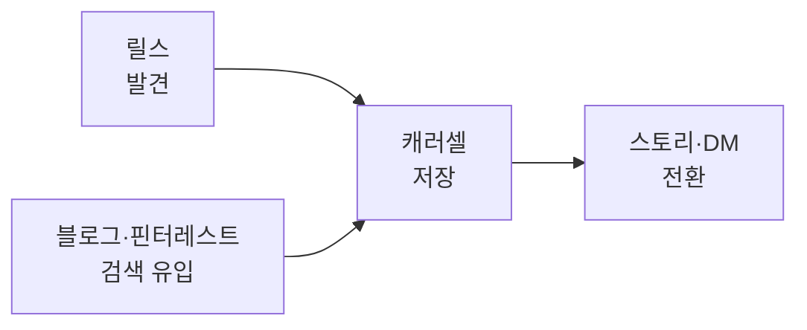

# 인스타 성장 플레이북

> 핵심 명제: 인스타 성장은 "예쁜 사진"이 아니라 **저장하고 공유하고 싶은 정보**에서 나옵니다. 알고리즘은 *체류·저장·공유·재방문*을 보고 더 많은 사람에게 노출합니다. 그래서 우리의 모든 콘텐츠는 "감상"이 아니라 "판단을 돕는 해설"을 지향합니다.

## 쉽게 말하면

> **한마디로:** 인스타 성장은 "예쁜 사진"이 아니라 **저장하고 공유하고 싶은 정보**에서 나옵니다. 좋아요보다 저장·공유가 알고리즘과 신뢰를 동시에 키웁니다.

포맷마다 역할을 나눠 줍니다 — 릴스로 **새 사람을 데려오고**, 캐러셀로 **저장하게 하고**, 스토리·DM으로 **문의를 만듭니다.**

## 1. 성장의 4가지 레버

| 레버 | 무엇을 늘리나 | 핵심 지표 |
|---|---|---|
| 도달(Reach) | 새 사람에게 노출 | 릴스 조회수, 탐색 노출 |
| 저장(Save) | "나중에 볼게" 신호 | 저장률 |
| 공유(Share) | "이거 봐" 확산 | 공유 수, DM 전달 |
| 전환(Convert) | 팔로우·문의·예약 | 팔로우 전환율, DM 문의 수 |

> 우선순위: **저장·공유 > 좋아요.** 좋아요는 휘발되지만 저장·공유는 알고리즘과 신뢰를 동시에 키웁니다.

## 2. 콘텐츠 역할 분담

채널 포맷마다 역할이 다릅니다. 한 포맷에 모든 걸 시키지 않습니다.

- **릴스(Reels)** = 발견. 새 사람을 데려온다.
- **캐러셀(Carousel)** = 저장. 정보를 정리해 "보관"하게 한다.
- **스토리/DM** = 전환. 친밀감과 문의를 만든다.
- **블로그·핀터레스트** = 검색 유입. 장기 트래픽을 축적한다.

## 3. 콘텐츠 기둥 (Content Pillars)

매번 새 주제를 고민하지 않도록 기둥을 정해두고 변주합니다.

| 기둥 | 목적 | 대표 포맷 |
|---|---|---|
| 공간 브리핑 | 왜 좋은 공간인지 해설 | 공간 분석 캐러셀, 릴스 보이스오버 |
| 전후 논리 | 변화의 *이유* 설명 | before/after, 실패 원인, 비용 대비 효과 |
| 소형공간 해결 | niche 검증 | 원룸·소형 수납·가구 배치·동선 |
| 예산별 스타일링 | 낮은 진입장벽 전환 | 예산별 쇼핑 리스트, 대체재 비교 |
| 상업공간 동선 | B2B 가능성 | 카페·매장 동선·좌석·포토존 |
| 자재·색·조명 | 전문성 신뢰 | 자재 비교, 색 팔레트, 조명 전후 |

## 4. 포맷 레시피 (훅 → 본문 → CTA)

| 포맷 | 훅 예시 | 본문 구조 | CTA |
|---|---|---|---|
| Before/After | "왜 이 집은 넓어 보일까?" | 전 → 문제 → 해결 → 후 | 저장, DM 상담 |
| 자재 비교 | "이 바닥재 고르면 후회하는 경우" | 선택지 3개 → 장단점 → 추천 상황 | 댓글 키워드 |
| 평수별 해결 | "10평 원룸에서 먼저 바꿀 것 3가지" | 문제 → 우선순위 → 배치 | 저장 유도 |
| 예산별 | "30만/100만/300만 차이" | 구간 → 효과 → 추천 조합 | 쇼핑 리스트 요청 |
| 실패 사례 | "예쁜데 불편한 집의 공통점" | 사례 → 원인 → 대안 | 상담 문의 |
| 상담 공개 | "1시간 공간 진단은 이렇게" | intake → 분석 → 제안 → 결과 | 예약 링크 |

### 작성 규칙

- 릴스는 **첫 2초** 안에 문제를 보여준다(스크롤을 멈추는 건 호기심·문제 제기).
- 캐러셀 1장은 결과보다 **질문형 훅**을 쓴다("좁아 보이는 이유").
- 캡션은 `문제 → 기준 → 예시 → CTA` 순서.
- 한 게시물에는 **하나의 판단 기준**만 담는다.

## 5. 릴스 전략

릴스는 현재 도달을 가장 크게 키우는 포맷입니다.

- **훅 우선**: 첫 프레임 + 첫 문장이 전부. "결과"가 아니라 "왜?"로 연다.
- **자막 필수**: 무음 시청자가 다수. 핵심 정보는 화면 텍스트로도 전달한다.
- **길이**: 7~15초의 짧은 정보형과, 과정·해설을 담은 30~45초형을 병행한다.
- **루프 설계**: 마지막 장면이 첫 장면과 자연스럽게 이어지면 재생 수가 늘어난다.
- **트렌드 음원**: 인기 음원을 빠르게 차용하되 정보 가치를 해치지 않는 선에서.
- **저장 유도 마무리**: "이건 저장해두세요" 한 줄로 저장률을 의도적으로 높인다.

## 6. 해시태그 전략

해시태그는 "마법의 노출 버튼"이 아니라 **분류·검색 보조**입니다.

- **혼합 구성(8~15개)**: 대형(`#인테리어`) + 중형(`#원룸인테리어`) + 소형/롱테일(`#10평원룸꾸미기`) + 브랜드(`#REUELMASION`)를 섞는다.
- **롱테일에 기회**: 경쟁이 적은 구체적 태그가 의도 높은 소수에게 도달한다.
- **지역 태그**: 지역 시공이라면 `#OO인테리어` 지역명을 넣어 로컬 검색을 잡는다.
- **금지**: 내용과 무관한 인기 태그 도배(스팸 신호), 매번 동일 세트 복붙(다양성 저하).
- **운영**: 주제별 태그 세트를 3~4벌 만들어 돌려 쓰고, 도달 데이터로 분기마다 갱신한다.

## 7. 협업 전략

협업은 신뢰를 빌려와 도달을 빠르게 키우는 방법입니다.

| 유형 | 방식 | 적합 상황 |
|---|---|---|
| 공동 게시물(Collab) | 두 계정에 동시 노출 | 비슷한 규모, 결이 맞는 계정 |
| 제품 협찬·태그 | 가구·조명·자재 브랜드와 상호 태그 | 쇼핑 리스트·리뷰 콘텐츠 |
| 마이크로 인플루언서 | 지역·소형 계정 다수와 진정성 협업 | 지역 시공, 비용 효율 |
| 크로스 추천 | 스토리 상호 소개 | 신뢰 이전, 저비용 |

- 협업 후보는 [[instagram-influencer-watch|인플루언서 관찰]]의 추적 카드에서 **결(스타일)·전환 장치·avoid_point**를 보고 고른다.
- 협업 전 "우리 톤(프리미엄·근거 중심)"과 충돌하지 않는지 확인한다.

## 8. 측정과 반복

- **주간**: 저장 상위 3개 게시물의 공통점을 찾아 다음 주 포맷으로 복제한다.
- **댓글 키워드 테스트**: 매주 1회 이상 "댓글에 OOO 쓰면 체크리스트 DM" 같은 전환 장치를 돌려 측정한다.
- **버리는 용기**: 4주간 도달·저장이 낮은 포맷은 과감히 접고 잘 되는 기둥에 집중한다.

## 9. 가드레일

- 타 계정 이미지·캡션을 무단 재게시하지 않는다(분석은 링크+요약).
- 견적·법규·구조 안전은 단정형 조언을 피하고 면책을 명시한다.
- 고객 사진은 공개 가능 여부를 별도 확인한다.
- 과장된 럭셔리 표현·근거 없는 단정·타 계정 비난은 쓰지 않는다.

## 관련 노트

- [[instagram-influencer-watch|인스타 인플루언서 관찰]] — 따라 할 포맷과 협업 후보의 출처.
- [[ad-media-catalog|광고매체 카탈로그]] — 인스타 밖에서 도달·전환을 보완.
