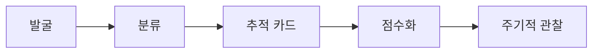

# 인스타 인플루언서 관찰

> 목적은 "유명 계정 수집"이 아니라 **사업 포지션 검증**입니다. 잘 되는 계정에서 *반복 가능한 구조*(포맷·훅·전환 장치)를 뽑아내 REUEL MASION에 적용할 수 있는지 판단하는 것이 이 노트의 역할입니다.

## 쉽게 말하면

> **한마디로:** "유명 계정 수집"이 아니라, 잘 되는 계정에서 **따라 할 수 있는 구조**(포맷·훅·전환 장치)를 뽑아 우리에게 맞는지 검증하는 작업입니다.

계정 하나를 보면 〈발굴 → 분류 → 추적 카드 기록 → 점수화 → 주기적 관찰〉의 흐름으로 처리합니다.

## 1. 어떻게 발굴하나 (Discovery)

좋은 벤치마크는 우연히 발견되지 않습니다. 다음 경로를 정기적으로 훑습니다.

- **해시태그 타고 들어가기**: `#인테리어스타그램` `#홈스타일링` `#집꾸미기` `#원룸인테리어` `#감성인테리어` 등에서 인기 게시물 상단을 본다.
- **탐색 탭(Explore) 학습시키기**: 우리가 벤치마크하려는 계정을 일부러 저장·정독해 탐색 탭이 비슷한 계정을 더 추천하도록 만든다.
- **"이런 계정도 팔로우" 추천**: 핵심 계정 프로필 우측의 추천 계정에서 인접 계정을 수집한다.
- **플랫폼 역추적**: 오늘의집·핀터레스트·유튜브에서 잘 나가는 인테리어 크리에이터의 인스타 계정을 찾아 묶는다.
- **태그·협찬 추적**: 가구·조명·자재 브랜드 계정이 태그한 인플루언서를 모은다(협업 시장의 실제 참여자).
- **인접 사례 분리 수집**: 인테리어 계정은 아니지만 공동구매·소통·스폰서십 구조가 뛰어난 계정은 "구조 참고용"으로 따로 분류한다.

## 2. 계정 분류 (Taxonomy)

발굴한 계정은 사업상 의미로 분류합니다.

| 분류 | 대상 | 우리에게 주는 의미 |
|---|---|---|
| 주거 디자이너 | 아파트·단독·가족 주거 | 포트폴리오 신뢰, 고가 상담 전환 |
| 소형공간 전문 | 원룸·오피스텔·소형 아파트 | 초기 niche 후보, 저장·공유형 강함 |
| 상업공간 디자이너 | 카페·매장·오피스 | 매출 동선·브랜딩, B2B 상담 |
| 홈 스타일리스트 | 가구 배치·색·패브릭·소품 | 낮은 진입장벽 상품·제휴 |
| 시공/리노베이션 | 목공·필름·타일·주방·욕실 | before/after, 견적 문의 전환 |
| DIY 크리에이터 | 셀프 시공·페인트·수납·조명 | 교육형 콘텐츠·클래스 후보 |
| 큐레이터/미디어 | 무드보드·레퍼런스·트렌드 | 해설형 리서치 포맷의 원형 |
| 제품/브랜드 | 가구·조명·자재·소품 | 협찬·리뷰·쇼핑 리스트 수익화 |

## 3. 계정별 추적 템플릿 (Tracking Card)

벤치마크할 계정 하나는 아래 카드로 기록합니다. 우선순위가 높은 계정부터 카드화하고, 단순 목록을 길게 붙이지 않습니다.

| 필드 | 기록 방식 |
|---|---|
| account_name | 계정 표시명 |
| handle | `@handle` |
| url | 인스타그램 URL |
| market | KR / Global / Local / Premium / DIY |
| follower_band | micro / mid / macro / mega / unknown |
| space_type | 주거·상업·원룸·주방·욕실·수납 등 |
| style_keywords | 미니멀·내추럴·모던·우드톤·호텔식 등 |
| format_mix | Reels·Carousel·Story·Live·Guide·YouTube·Blog |
| hook_pattern | 첫 문장/첫 장면 반복 패턴 |
| cta_pattern | DM·댓글 키워드·링크·상담폼·저장 유도 |
| monetization | 시공문의·상담·제품판매·제휴·강의 |
| benchmark_value | 우리가 적용할 포인트 |
| avoid_point | 따라 하면 안 되는 점 |
| last_checked | 마지막 확인 날짜(수치 재검증용) |

### 팔로워 구간 정의

| 구간 | 대략 범위 | 협업 관점 |
|---|---|---|
| micro | ~1만 | 단가 낮고 진정성·참여율 높음, 지역 협업 적합 |
| mid | 1만~10만 | 비용 대비 효율 구간, 검증된 포맷 보유 |
| macro | 10만~100만 | 도달 큼, 단가 상승, 브랜드 핏 검증 필요 |
| mega | 100만+ | IP형, 대형 캠페인용, 초기엔 학습 대상 |

## 4. 무엇을 보고 평가하나 (Scoring Rubric)

계정을 발견하면 5점 척도로 빠르게 점수화해 벤치마크 우선순위를 정합니다.

| 항목 | 1점 | 3점 | 5점 |
|---|---|---|---|
| 포맷 반복성 | 불규칙 | 일부 반복 포맷 | 매주 반복 가능한 시리즈 |
| 저장·공유 가치 | 감상형 | 팁 일부 | 체크리스트·비교·실패 방지 정보 |
| 전환 명확성 | CTA 없음 | 링크/DM 있음 | 명확한 상품·문의·댓글 퍼널 |
| 차별화 | 흔한 포트폴리오 | 스타일 차별 | 관점·방법론·상품이 분명 |
| 우리 적합도 | 모방 가치 낮음 | 일부 참고 | 바로 실험 가능한 포맷 |

> **읽는 법**: "저장·공유 가치"와 "전환 명확성"이 동시에 높은 계정이 가장 배울 게 많습니다. 팔로워가 커도 전환 장치가 없으면 우선순위를 낮춥니다.

## 5. 관찰 주기 (Cadence)

- **주간**: 핵심 벤치마크 5~8개의 신규 게시물에서 잘 된 포맷 1개를 캡처해 메모.
- **월간**: 새 계정 발굴 라운드 + 추적 카드 갱신(`last_checked`).
- **분기**: 분류별 빈칸(우리가 채워야 할 niche) 점검 — 예: 우리 주변 지역 인테리어, 상업공간 동선, 주방·욕실 세부 공종.

## 6. 윤리·법적 가드레일

- 타 계정의 이미지·캡션·도면 원문을 무단 저장·재게시하지 않는다. 분석이 필요하면 **링크 + 요약**으로 대체한다.
- 분석용 스크린샷은 내부 메모 범위로 제한하고, 출처를 함께 남긴다.
- 팔로워·조회수는 시점 값이므로 제안서·광고비 추정 전 당일 재확인한다.

## 관련 노트

- [[instagram-growth-playbook|인스타 성장 플레이북]] — 관찰에서 얻은 포맷을 실제 콘텐츠로.
- [[ad-media-catalog|광고매체 카탈로그]] — 인플루언서 협업을 유료 채널과 함께 설계.
