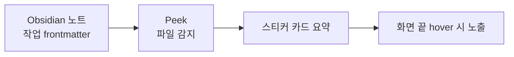

# Peek — 항상 보이는 AI 작업 위젯

> **마우스를 화면 우측 끝에 올리면 AI 작업 현황이 살짝(peek) 보이는 데스크톱 위젯.** 평소엔 숨어 있다가, 필요할 때만 나타난다.

## 쉽게 말하면

> **한마디로:** 마우스를 화면 끝에 갖다 대면 **AI 작업 현황이 살짝 보이는** 데스크톱 위젯입니다. 평소엔 숨어 있다가 필요할 때만 나타나 방해하지 않습니다.

따로 입력할 필요 없이, 옵시디언 노트에 적힌 작업 정보를 읽어 카드로 보여줍니다.

## 무엇을 해결하나

AI 에이전트를 여러 개 동시에 돌리면 생기는 공통의 답답함이 있습니다.

- **창이 많아 상태가 안 보인다** — 터미널·에디터·브라우저가 뒤섞이면 "지금 어떤 작업이 진행 중이고 뭐가 끝났는지" 추적이 끊긴다.
- **메모가 작업과 따로 논다** — 진행 중 떠오른 메모는 다른 앱에 적어 두면 곧 잊힌다.
- **확인하려면 흐름이 깨진다** — 상태를 보려고 창을 전환하는 순간 집중이 흩어진다.

Peek은 이 셋을 **"항상 화면 한쪽에 떠 있는 가벼운 위젯"** 하나로 묶습니다. 작업 상태와 메모를 늘 시야 안에 두되, 평소엔 화면 끝에 숨겨 두어 방해하지 않습니다.

## 어떻게 동작하나

핵심은 **별도 입력이 필요 없다**는 점입니다.

1. **노트를 읽는다** — Obsidian Vault의 `.md` 파일에 적힌 작업 frontmatter(담당 AI, 프로젝트, 상태, 진행률 등)를 실시간으로 감지한다.
2. **카드로 요약한다** — 감지한 작업을 스티커 카드 형태로 정리해 위젯에 띄운다.
3. **슬쩍 보여준다** — 평소엔 화면 우측 끝에 숨어 있고, 마우스를 가져가면 카드가 드러난다.

작업 노트를 평소처럼 쓰기만 하면, 그 상태가 곧 위젯에 반영됩니다. 별도의 대시보드에 다시 입력할 필요가 없습니다. 이 점에서 Peek은 [[knowledge/obsidian/index|Obsidian × 생성형 AI]] 흐름과 자연스럽게 맞물립니다.

## 무엇으로 만들었나

| 레이어 | 기술 |
|--------|------|
| 프레임워크 | Tauri 2.x (Rust + WebView) |
| 프론트엔드 | Svelte 5 + TypeScript |
| 파일 감지 | Rust 파일 워처(notify) |
| 노트 파싱 | YAML frontmatter 파서 |
| 로컬 저장 | SQLite(로컬, 외부 전송 없음) |
| 모바일 알림 | (선택) 메신저 봇 연동 |

가볍고 빠른 네이티브 위젯을 목표로 했기 때문에, 무거운 일렉트론 대신 **Rust 코어 + Svelte UI**를 택했습니다. 작업 데이터는 로컬 SQLite에만 저장되어 외부로 나가지 않습니다.

## 지금 어디까지 왔나

Peek은 **개인이 쓰는 도구로 동작하는 단계**입니다. 노트 감지 → 카드 표시 → 화면 끝 hover 노출이라는 기본 흐름이 돌아갑니다. 이후 방향은 단순 나열을 넘어 **카테고리·속성 기준으로 메모를 교차 배치하는 대시보드(Peek Pivot)**로 확장하는 것을 검토 중입니다. 아직 정식 배포 제품이 아니라, 강의에서 "이렇게 직접 만들어 쓴다"를 보여 주는 실물 사례로 다룹니다.

## 관련 허브

- [[ai-agent-roles|AI 에이전트]] — 여러 AI를 역할별로 나눠 돌리는 구조. Peek은 그 작업들을 한눈에 모아 보여준다.
- [[harness-engineering|하네스 엔지니어링]] — 작업 상태·핸드오프를 노트로 관리하는 방법론이 Peek의 데이터 원천이다.
- [[channeldock|ChannelDock]] — 같은 "직접 만든 도구" 갈래의 다른 제품.
