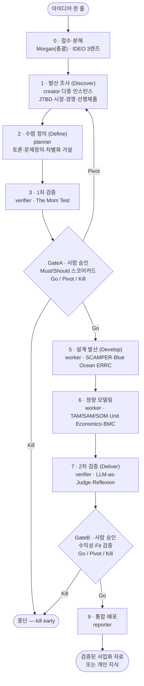

# 아이디어 검증 파이프라인 — AI 에이전트로 '근거 붙은 아이디어'만 키우기

머릿속 아이디어 한 줄을, 흩어진 추측이 아니라 **실제로 존재하는 전문 방법론**에 따라 검증·정제해서, 마지막에 "현실성 있는 사업화 자료" 또는 "정리된 개인 지식"으로 산출하는 멀티에이전트 파이프라인이다. 핵심은 두 가지. 첫째, 검증된 방법론을 **단계별 순서로 강제**한다. 둘째, 여러 에이전트가 **흩어져 조사하고(발산) 모여서 반박하며 수렴하는(검증)** 과정을 사람 승인 게이트로 감싼다. 그래서 "좋아 보이는 아이디어"가 아니라 **"근거가 붙은 아이디어"** 만 통과한다.

> [!abstract] 한 줄 정의
> *아이디어 → (실전 방법론 기반) 다단계 검증·인큐베이션 → 출처가 붙은 사업화 자료 또는 지식* 으로 변환하는, 멀티에이전트 + 게이트 거버넌스 엔진.

## 무엇을 하는 엔진인가

"아이디어를 평가해주는 챗봇"이 아니라 "아이디어를 끝까지 밀어 사업화 직전까지 키우는 인큐베이터"다. 입력과 출력을 명확히 하면 다음과 같다.

| 구분 | 내용 |
|---|---|
| **입력(Input)** | 아이디어 한 줄(주제). 예: "1인 게스트하우스 운영자를 위한 자동 정산 도구" |
| **처리(Process)** | 5대 검증축으로 분해 → 방법론별 병렬 조사(발산) → 토론·반박 수렴 → 정량 모델링 → 적대적 검증 → 사람 승인 게이트 |
| **출력(Output)** | (a) 현실성 있는 사업화 자료(시장규모·경쟁·차별화·수익성·리스크, 출처 URL 포함) 또는 (b) 정리된 개인 지식 노트 |

5대 검증축은 IDEO의 **Desirability–Feasibility–Viability(바람직함–실현가능성–사업성)** 3렌즈를 우산 프레임으로 삼아 매핑된다.

| 검증축 | IDEO 3렌즈 | "이걸 확인한다" |
|---|---|---|
| (1) 타당성 | Desirability + Viability | 진짜 문제인가, 원하는 사람이 있나 |
| (2) 선행/유사 제품·차별화 | (시장 진단) | 이미 있나, 있다면 어떻게 다른가 |
| (3) 실현가능성 | Feasibility | 기술적으로 만들 수 있나 |
| (4) 수익성 | Viability | 단위당 돈이 남나, 시장이 큰가 |
| (5) 컨셉 적합성 | Desirability | 내 컨셉/회사와 맞나 (또는 무관해도 되나) |

## 파이프라인 한눈에 보기

상위 박자는 **Double Diamond**(발산↔수렴 2회), 거버넌스는 **Stage-Gate**(게이트 = 산출물 + Must/Should 기준 + Go/Kill/Hold/Recycle), 전체 루프는 **Lean Startup**(Build-Measure-Learn, pivot=되돌리기)이다.

## 파이프라인 10단계 — 누가, 무엇을, 어떻게

사용자가 막연히 떠올린 "투척 → 흩어져 조사 → 모여 검증 → 데이터 → 재검증" 흐름을 실제 방법론으로 대체·보강하면 다음 단계가 된다.

| # | 단계 | 기반 방법론 | 담당 에이전트 | 무엇을 / 어떻게 | 게이트 |
|---|---|---|---|---|---|
| 0 | 접수·분해 | IDEO 3렌즈 | **Morgan**(총괄) | 아이디어를 5대 검증축으로 분해, 게이트 기준 세팅, 작업 분배 | — |
| 1 | 발산 조사(Discover) | Double Diamond·RAG·ReAct·Brainwriting | **creator** 다중 | 흩어져 병렬 조사: JTBD 고객 job·미충족 니즈 / 선행·유사 제품 / 시장(TAM/SAM/SOM) / 경쟁(Five Forces) — 모든 수치에 출처 URL | — |
| 2 | 수렴 정의(Define) | d.school Define·Multi-Agent Debate | **planner** + creator | 흩어진 결과를 모아 토론·반박, 문제정의(How-Might-We), ODI 기회점수·차별화 가설 | — |
| 3 | 1차 검증 | The Mom Test·no-silent-pass | **verifier** | 근거가 "과거 사실"인가 vs 칭찬/가정/희망인가 판정, 출처·환각 점검 | — |
| 4 | **GateA** | Stage-Gate | Morgan→사람 | Must-meet(차별점·컨셉 타당·치명결격 없음→미충족시 Kill) + Should-meet(기회점수·YC 스코어카드) | **GateA** |
| 5 | 설계 발산(Develop) | SCAMPER·TRIZ·Crazy 8s·Blue Ocean ERRC | **worker** + creator | 차별화 안 다수 생성→비평·투표로 최강안 선정, 컨셉·기능 스펙 | — |
| 6 | 정량 모델링 | TAM/SAM/SOM·Unit Economics·BMC/VPC | **worker** | 시장규모 적층, LTV·CAC·Payback(가정+민감도), BMC 9블록·VPC Fit | — |
| 7 | 2차 검증(Deliver) | Stage-Gate·LLM-as-Judge·Reflexion | **verifier** | 격리 검증: 계산식·이중계산 교차확인, "어중간 함정" 점검, 실패는 일화기억에 남기고 재작업 | — |
| 8 | **GateB** | Stage-Gate | verifier→사람 | validated learning 확보 + Fit 검증 + 수익성(LTV가 CAC 초과) 근거 | **GateB** |
| 9 | 통합·배포(Launch) | Customer Creation | **reporter** | 검증 자료를 "사업화 자료" 또는 "개인 지식"으로 통합, 출처 URL 포함 배포 | — |

> [!tip] 추측 단계 → 방법론 매핑
> "흩어져 조사" = creator 다중 인스턴스의 프레임별 병렬 조사. "모여서 검증" = GateA + Multi-Agent Debate. "데이터 수집" = TAM/SAM/SOM·Unit Economics 정량 모델링. "재검증" = GateB의 적대적 검증 루프(Reflexion 기반 재작업).

## 어떤 실전 방법론을 쓰나 — 검증된 핵심 프레임워크

지어낸 프레임이 아니라, 학계·업계에서 검증된 방법론이다. 분야별 핵심만 정리한다.

### 발상·창의 (발산)

| 방법론 | 출처 | 핵심 |
|---|---|---|
| Design Thinking 5모드 | [Stanford d.school](https://dschool.stanford.edu/tools/design-thinking-bootleg) | 공감→정의→발상→프로토타입→테스트 |
| Design Sprint(5일) | [GV](https://www.gv.com/sprint/) | 지도→스케치→결정→프로토타입→고객 5명 테스트 |
| Double Diamond | [UK Design Council](https://www.designcouncil.org.uk/resources/the-double-diamond/) | 발견·정의 + 개발·전달, 발산↔수렴 2회 |
| SCAMPER | [Bob Eberle](https://en.wikipedia.org/wiki/SCAMPER) | 대체·결합·응용·수정·전용·제거·역전 7렌즈 |
| JTBD / ODI | [Strategyn](https://strategyn.com/jobs-to-be-done/) | "고객은 job을 끝내려 산다", 기회 = 중요도 + max(중요도−만족도, 0) |
| First Principles | [Farnam Street](https://fs.blog/first-principles/) | 통념 해체→공리까지 분해→재추론 |
| Crazy 8s / Brainwriting 6-3-5 | [Design Sprint Kit](https://designsprintkit.withgoogle.com/methodology/phase3-sketch/crazy-8s) | 침묵 병렬·시간압축 대량 발산 |

### 검증·사업화 (수렴)

| 방법론 | 출처 | 핵심 |
|---|---|---|
| Lean Startup (BML/MVP) | [Eric Ries](https://theleanstartup.com/principles) | Build–Measure–Learn 루프, validated learning, pivot |
| Customer Development | [Steve Blank](https://en.wikipedia.org/wiki/Customer_development) | Discovery→Validation→Creation→Building |
| Disciplined Entrepreneurship | [Bill Aulet, MIT](https://mitsloan.mit.edu/ideas-made-to-matter/disciplined-entrepreneurship-6-questions-startup-success) | 24단계, 6테마, MVBP 검증 |
| The Mom Test | [Rob Fitzpatrick](https://www.momtestbook.com/) | 과거 사실만 신뢰, 칭찬·가정·희망은 버린다 |
| YC 아이디어 평가 | [Kevin Hale, YC](https://www.ycombinator.com/library/8g-how-to-evaluate-startup-ideas) | Value/Growth 가설, 좋은 문제 6특징 |
| Stage-Gate | [Robert Cooper](https://www.stage-gate.com/blog/the-stage-gate-model-an-overview/) | 게이트 3요소(산출물+기준+Go/Kill/Hold/Recycle) |
| BMC / VPC | [Strategyzer](https://www.strategyzer.com/library/the-value-proposition-canvas) | 9블록 사업구조 / Jobs·Pains·Gains ↔ Fit |

### 시장·경쟁·차별화·수익성

| 방법론 | 출처 | 핵심 |
|---|---|---|
| IDEO 3렌즈 | [IDEO](https://designthinking.ideo.com/) | Desirability·Feasibility·Viability 우산 프레임 |
| Porter's Five Forces / Generic | [HBR](https://hbr.org/2008/01/the-five-competitive-forces-that-shape-strategy) | 산업 매력도 5요인, 원가우위/차별화/집중 |
| TAM/SAM/SOM | [HubSpot](https://blog.hubspot.com/marketing/tam-sam-som) | 시장규모, top-down × bottom-up 교차검증 |
| Unit Economics (LTV/CAC) | [Chargebee](https://www.chargebee.com/resources/glossaries/ltv-cac-ratio/) | LTV:CAC, CAC Payback |
| Prior-Art / FTO | [PatentPC](https://patentpc.com/blog/how-to-conduct-a-freedom-to-operate-fto-search) | 선행기술·침해 1차 스크리닝(법적 확정은 변리사) |
| Competitive Matrix | [Semrush](https://www.semrush.com/blog/competitive-matrix/) | 기능 비교·포지셔닝 맵으로 white space 발굴 |
| Blue Ocean (ERRC) | [Kim & Mauborgne](https://www.blueoceanstrategy.com/tools/errc-grid/) | 제거·축소·상승·창조로 차별화+저비용 동시 |
| Positioning | [Ries & Trout](https://en.wikipedia.org/wiki/Positioning_(marketing)) | 고객 인식 속 차별적 위치 점유 |

### 엔진을 떠받치는 LLM 멀티에이전트 기법

| 기법 | 출처 | 역할 |
|---|---|---|
| RAG | [Lewis et al., 2020](https://arxiv.org/abs/2005.11401) | 검색 근거로 생성 → 환각 감소, 출처 명확 |
| ReAct | [Yao et al., 2023](https://arxiv.org/abs/2210.03629) | 추론↔행동(검색)↔관찰 반복 |
| Multi-Agent Debate | [Du et al., 2023](https://arxiv.org/abs/2305.14325) | 여러 에이전트가 반박·수렴 → 사실성 향상 |
| Self-Consistency | [Wang et al., 2023](https://arxiv.org/abs/2203.11171) | 수치/점수를 다중 샘플링 다수결로 교차검증 |
| Reflexion | [Shinn et al., 2023](https://arxiv.org/abs/2303.11366) | 실패를 성찰로 일화기억에 저장 → 재작업 개선 |
| CAMEL / LLM-as-Judge | [CAMEL](https://arxiv.org/abs/2303.17760) · [Agent-as-Judge](https://arxiv.org/abs/2410.10934) | 역할분담 협업 + AI 심판 채점 |

## 좋은·현실성·창의성 있는 아이디어를 만드는 순서

좋은 아이디어는 **"창의 → 검증 → 현실성 → 차별화"** 의 리듬에서 나온다.

1. **발산(창의)** — 첫 아이디어 고착을 깬다. Crazy 8s, Brainwriting 6-3-5, SCAMPER, First Principles. 여러 에이전트가 서로 다른 프레임으로 동시에 안을 낸다.
2. **수렴(검증)** — 넓힌 것을 좁힌다. Define으로 문제를 재정의하고, JTBD/ODI로 미충족 기회를 **중요도 + max(중요도−만족도, 0)** 점수로 정량화한다. The Mom Test로 근거가 "사실"인지 거른다.
3. **현실성(시장·수익·실현)** — 숫자로 증명한다. TAM/SAM/SOM을 top-down × bottom-up으로 교차검증하고, Unit Economics로 단위당 채산성을, BMC로 사업구조를 확인한다.
4. **차별화** — "그래서 어떻게 다른가"에 답한다. Competitive Matrix로 white space를 찾고, Blue Ocean ERRC로 차별화+저비용을 동시에 노린다. Porter Generic으로 "어중간 함정"을 피한다.

> [!warning] 발산과 수렴을 섞지 마라
> Double Diamond의 핵심 교훈은 "넓힐 때와 좁힐 때를 분리"하는 것이다. 발산 중에 판단하면 아이디어가 죽고, 수렴해야 할 때 계속 벌리면 결론이 안 난다. 발산=creator, 수렴=planner+verifier(게이트)로 역할을 물리적으로 분리해 이 리듬을 강제한다.

## 예시 한 바퀴 — 아이디어 1개가 파이프라인을 도는 모습

**투척 아이디어:** "1인·소규모 게스트하우스 운영자를 위한 자동 정산·세무 도구"

| 단계 | 누가 | 무엇을 했나 |
|---|---|---|
| 접수 | Morgan | 5대 축으로 분해, 게이트 기준 세팅 |
| 발산 조사 | creator ×3 | JTBD("월말 정산·세금신고 시간 최소화" job 발굴) / 선행제품(채널매니저·PMS·회계SW) / 시장(소규모 숙박 사업자 수 × 객단가로 SOM) |
| 수렴 정의 | planner | Debate로 반박 후, ODI 기회점수("정산 정확도" 과소충족 발견), 차별화 가설="기존은 회계 일반론, 우리는 숙박 특화 자동 정산" |
| 1차 검증 | verifier | 운영자 근거가 "지난달 실제로 3시간 썼다"(사실)인지 "있으면 좋겠다"(희망)인지 분류 |
| **GateA** | 사람 | Must(차별점·타당성 OK) + Should(기회점수 통과) → **Go** |
| 설계 발산 | worker | ERRC: 일반 회계 *축소*, 채널 연동·자동 분개 *상승*, 숙박 특화 세무 리포트 *창조* |
| 정량 모델링 | worker | SOM × 구독가로 매출, LTV:CAC 추정(가정·민감도), BMC, VPC Fit |
| 2차 검증 | verifier | LTV 공식·시장 이중계산 교차확인, "특허 침해는 전문가 필요" 플래그 |
| **GateB** | 사람 | 수익성 근거·Fit 확인 → **Go** |
| 통합·배포 | reporter | 시장·경쟁·차별화·수익성·리스크·출처를 한 문서로 통합 |

## 컨셉 적합성 판단 — 내 컨셉과 맞아야 하나, 무관해도 되나

모든 아이디어가 사용자/회사 컨셉과 맞을 필요는 없다.

| 질문 | 도구 | "컨셉 적합 필요" 신호 | "컨셉 무관해도 됨" 신호 |
|---|---|---|---|
| 누구의 인식을 점유하나 | Positioning | 기존 컨셉/브랜드 자산을 레버리지해야 통함 | 새 카테고리를 스스로 만들 수 있음 |
| Jobs/Pains/Gains가 맞나 | VPC | 기존 고객 세그먼트와 동일 | 다른 세그먼트라도 자체 Fit 성립 |
| unfair advantage는 | YC | 기존 자산 기반 우위 | Market/Product 자체 우위로 독립 가능 |
| 사업성이 서나 | IDEO Viability | 기존 채널·자원 재사용 필요 | 독립 채널·자원으로도 수익 성립 |

**리트머스:** VPC Customer Profile을 그려보라. 기존 컨셉과 다른 고객인데도 Jobs/Pains/Gains에 자체적으로 Fit 한다면 "컨셉 무관 아이디어"로 분리해 별도 트랙(개인 지식 또는 독립 사업)으로 보낸다. 자체 Fit이 약하고 기존 자산에 기대야만 성립하면 "컨셉 적합 필수"로 분류해 컨셉 정렬을 GateA의 Must-meet에 넣는다.

> [!success] 결론
> 정체성은 "아이디어 평가기"가 아니라 **검증된 방법론을 강제하는 인큐베이션 엔진**이다. 발산(creator)–수렴(planner)–구현(worker)–검증(verifier)–배포(reporter)를 Morgan이 오케스트레이션하고, GateA/GateB의 Go/Kill로 약한 아이디어를 일찍 죽인다. 그 결과는 "느낌상 좋은 아이디어"가 아니라 **출처가 붙은, 시장·수익·차별화가 검증된 자료**다.

> [!note] 솔직한 단서
> 위 "방법론 ↔ 에이전트" 매핑은 검증된 방법론을 멀티에이전트 구조에 정합시킨 **설계 제안**이다. 실제 구현 시에는 게이트 임계값·단계 DAG를 코드와 1:1로 대조·보정해야 한다. 다음으로 박아야 할 것: ① GateA/GateB에 Stage-Gate식 스코어카드(산출물+Must/Should+Go/Kill) 명문화 ② verifier가 LTV/CAC·TAM/SAM/SOM에 (가정 명시 + 민감도 + top-down×bottom-up)를 요구 ③ ODI 성공률·Unit Economics 벤치마크(3:1 등)·FTO 법적 결론은 단정 말고 플래그 유지.

## 관련 노트

- [[ai-agent-roles|AI 에이전트 역할]] — 발산·수렴·검증을 누가 맡는가(역할 분리)
- [[agent-catalog|에이전트 카탈로그]] — 오케스트레이터·서브에이전트·MCP 위계
- [[agent-decision-escalation|의사결정과 에스컬레이션]] — 게이트(사람 승인) 경계의 토대
- [[business/startup-ai/index|창업 × AI]] — 이 파이프라인이 들어가는 회사 운영 구조

## 참고 출처

- Design Thinking: https://dschool.stanford.edu/tools/design-thinking-bootleg
- Design Sprint: https://www.gv.com/sprint/
- Double Diamond: https://www.designcouncil.org.uk/resources/the-double-diamond/
- SCAMPER: https://en.wikipedia.org/wiki/SCAMPER
- JTBD / ODI: https://strategyn.com/jobs-to-be-done/
- First Principles: https://fs.blog/first-principles/
- Crazy 8s: https://designsprintkit.withgoogle.com/methodology/phase3-sketch/crazy-8s
- Lean Startup: https://theleanstartup.com/principles
- Customer Development: https://en.wikipedia.org/wiki/Customer_development
- Disciplined Entrepreneurship: https://mitsloan.mit.edu/ideas-made-to-matter/disciplined-entrepreneurship-6-questions-startup-success
- The Mom Test: https://www.momtestbook.com/
- YC Evaluate Startup Ideas: https://www.ycombinator.com/library/8g-how-to-evaluate-startup-ideas
- Stage-Gate: https://www.stage-gate.com/blog/the-stage-gate-model-an-overview/
- BMC / VPC: https://www.strategyzer.com/library/the-value-proposition-canvas
- IDEO 3렌즈: https://designthinking.ideo.com/
- Porter Five Forces: https://hbr.org/2008/01/the-five-competitive-forces-that-shape-strategy
- TAM/SAM/SOM: https://blog.hubspot.com/marketing/tam-sam-som
- Unit Economics: https://www.chargebee.com/resources/glossaries/ltv-cac-ratio/
- Prior-Art / FTO: https://patentpc.com/blog/how-to-conduct-a-freedom-to-operate-fto-search
- Competitive Matrix: https://www.semrush.com/blog/competitive-matrix/
- Blue Ocean (ERRC): https://www.blueoceanstrategy.com/tools/errc-grid/
- RAG: https://arxiv.org/abs/2005.11401
- ReAct: https://arxiv.org/abs/2210.03629
- Multi-Agent Debate: https://arxiv.org/abs/2305.14325
- Self-Consistency: https://arxiv.org/abs/2203.11171
- Reflexion: https://arxiv.org/abs/2303.11366
- CAMEL / Agent-as-Judge: https://arxiv.org/abs/2303.17760
