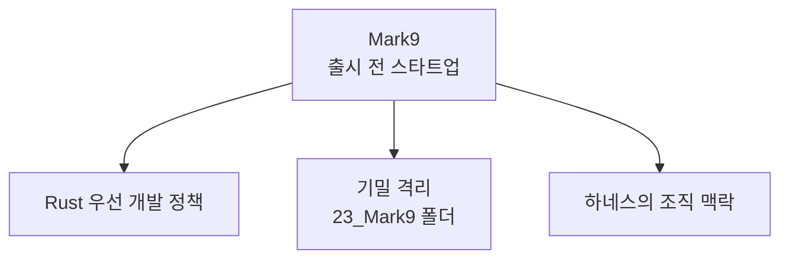

# Mark9

[[harness-engineering|하네스]] 뒤에 있는 조직적 맥락이다.

## 쉽게 말하면

> **한마디로:** Mark9는 이 하네스(규칙집)가 만들어진 **실제 조직 맥락**인 출시 전 스타트업입니다. 개발은 **Rust를 먼저** 쓰고, 회사 기밀은 별도 폴더로 **격리**합니다.

## 핵심 사실

- **유형:** 출시 전(창업 준비 단계) 스타트업.
- **개발 정책:** **Rust 우선** — 시스템 / 서비스 / CLI / 자동화는 기본적으로 Rust를 쓴다. 이것이 [[agent-decision-rules|기술 선택 규칙]]을 이끈다: Rust를 먼저 시도하고, 쓰지 않으면 이유를 기록한다. 실험·UI·AI/ML·빠른 검증에는 Python/TS/React 허용.
- **기밀:** Mark9 시크릿은 전용 `23_Mark9/` 폴더 규칙에 따라 처리하며, 기준은 `23_Mark9/company-confidential-profile.md`에 있다. [[agent-security-policy|보안 정책]]이 엄격히 강제한다 — 직원 정보 / 사업계획 / 미공개 기술의 외부 업로드 금지, AI 응답에 Mark9 시크릿 포함 금지.

## 작업 공간과의 관계

Mark9는 더 넓은 "AI 작업 공간 관리" 미션의 한 갈래다. 사용자(권태향)는 바로 이 Mark9 정책 때문에 Rust 학습을 시작했다. [[ai-agent-roles]]와 [[obsidian-vault]] 참고.

## 출처

내부 하네스 규칙 문서(`00_Harness/project-mission-context.md`, `00_Harness/agent-security-policy.md`)를 큐레이션해 정리했다.
