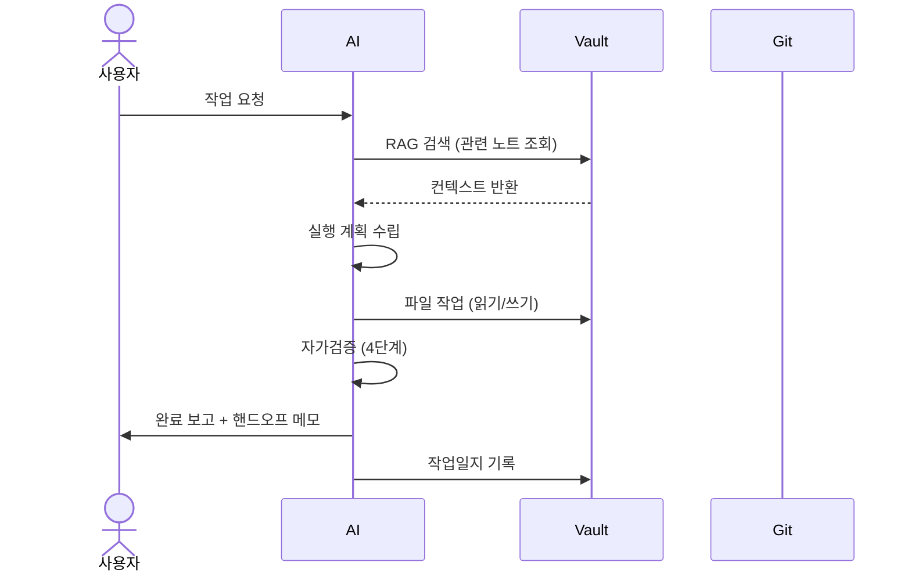
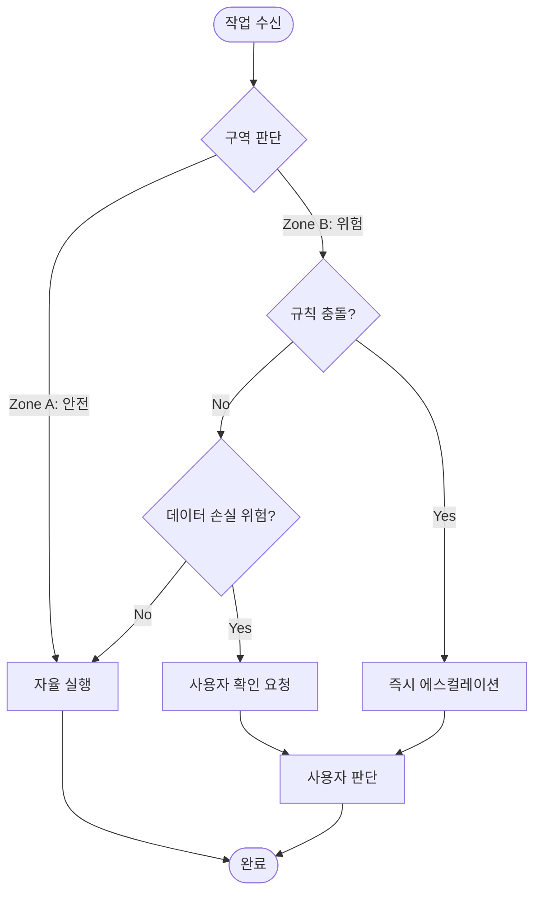

# 에이전트 워크플로우 흐름도

하네스의 주요 흐름을 시각화한 문서다. 여기서는 산문과 다이어그램으로 정리한다.

## 1. 전체 세션 흐름

세션 시작 → 전역 설정 로드 → 공유 허브 확인 → 하네스 참조 → 볼트 검색 → 실행 → 성공/실패 분기(실패 → [[failure-recovery-protocol]]) → 품질 검증([[task-completion-standards]] 체크리스트) → 통과/실패(실패 → 수정 후 재검증) → 완료 보고 → 작업일지 갱신.

*위 시퀀스 다이어그램은 사용자 요청 수신부터 작업 완료 및 일지 기록까지의 전체 세션 생애주기를 표현한 것입니다.*

## 2. 에스컬레이션 의사결정 트리

요청 → 파괴적(삭제/push/외부 전송)? → 예: 사용자 확인 필요 → 아니오: 보안 위반(시크릿/PII)? → 예: 즉시 중단 + 보고 → 아니오: 50개 이상 파일? → 예: 사용자 확인 → 아니오: 자율 진행. [[agent-decision-escalation]]에서 형식화한다.

*위 플로우차트는 작업의 영향도와 위험 등급에 따른 자율 실행과 에스컬레이션 결정 기준을 나타낸 것입니다.*

## 3. AI 협업 흐름

Claude ⇄ Gemini(기획/리서치 초안) → Claude가 코드를 Codex에 위임 → Codex가 산출물 반환 → Claude가 통합 → 볼트 저장 + 작업일지 + 사용자 보고. [[ai-agent-roles]] 참고.

## 4. 일반 멀티-AI 개발 워크플로우

요구사항(사용자) → 리서치/기획(Gemini) → 설계 문서(Claude) → 코드(Codex) → 리뷰(Claude + 사용자) → 통합/배포 준비(Codex) → 최종 문서(Claude). 본래 MDTS 형태였으나 v1.1에서 일반형으로 재작성했다.

## 5. 볼트 파일 생애주기

draft → active → done → archived(`99_archive/`). 폴더 흐름: `00_inbox` → `01_projects/<project>` → `99_archive`.

## 6. 시크릿 처리 흐름

시크릿 발견 → 즉시 중단 → P0 경보 → 파일에서 제거 → 분기: git에 없음(완료) vs git 히스토리에 있음(`git-filter-repo` 안내). [[agent-security-policy]]와 연결된다.

## 출처

내부 하네스 규칙 문서(`00_Harness/agent-workflow-diagram.md`)를 큐레이션해 정리했다.
