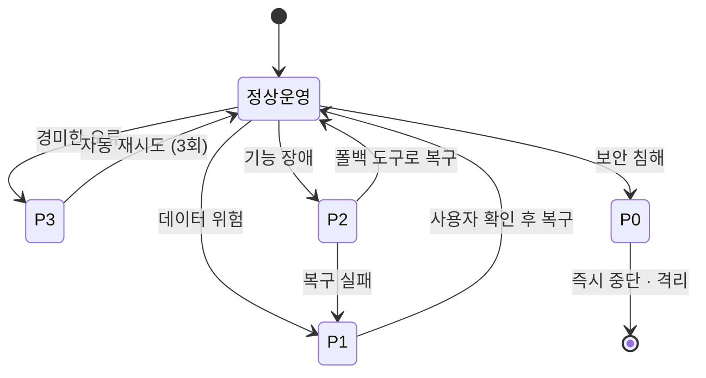

# 실패 복구 프로토콜

에러·실패·예외에 대한 표준 복구 절차다. 심각도 모델 자체는 [[failure-recovery-grading]]에서 개념적으로 다룬다.

## 심각도 등급

| 등급 | 의미 | 예 | 즉시 행동 |
|---|---|---|---|
| P0 — Critical | 데이터 손실, 보안 침해 | 파일 삭제, 시크릿 노출 | 모든 작업 중단 + 사용자 경보 |
| P1 — High | 작업 완전 차단 | 도구 에러, 환경 불가 | 대안 시도 → 안 되면 경보 |
| P2 — Medium | 부분 실패, 품질 저하 | 일부 파일 생성 실패 | 성공 보고, 실패 나열 |
| P3 — Low | 경미한 불편 | 파일명 규칙 위반 | 고치고 계속 |

## 실패 복구 상태 전환도

*위 상태 천이도는 오류 등급별 처리 경로와 시스템 상태 복구 흐름을 나타낸 것입니다.*

## P0 절차

- **데이터 손실:** 모든 작업 중단 → 삭제된 경로 기록 → 사용자 경보 → git status/log 확인 → 복구안 제시(git checkout, 휴지통, 백업) → 사용자 지시에 따라 복구.
- **시크릿 노출:** 파일/코드 격리(추가 배포 차단) → 사용자 경보 → 폐기/교체 안내 → 시크릿 제거 → git 히스토리에 있으면 `git-filter-repo` 안내. [[agent-security-policy]]와 연결된다.

## P1 / P2

- **도구 실패 폴백:** Read → PowerShell `Get-Content`; Write → Bash `tee` / 경로 확인; MCP → 직접 파일 접근. 대안도 실패하면 정확한 에러 + 수동 절차를 제시한다. 환경 불일치: 실제 경로 검증(Glob/PowerShell), 권한 문제는 수동 실행 안내, 안전할 때만 누락 폴더 생성.
- **부분 실패(P2):** 성공/실패를 구분하고, 각 실패에 이유를 붙이고, 부분 상태를 작업일지에 기록하며, 재시도 가능 여부를 구분하고, 보고에 "부분 완료"로 표시한다.

## 에러 보고 형식

등급 / 타임스탬프 / 에러 내용(원문 그대로) / 영향 범위 / 복구 시도 / 현재 상태(복구됨 / 부분 / 미해결) / 사용자 조치 필요 여부.

## 재시도 규칙

재시도 가능: 네트워크 에러(×1), 파일 락(잠시 후 ×1). 재시도 불가: 권한 에러(→ 사용자 안내), 보안 에러(→ 즉시 보고). 무한 sleep-재시도 루프 금지.

## 로깅

P0·P1 에러는 작업일지에 기록한다: 등급·내용, 복구 방법·결과, 재발 방지 교훈, 다음 세션 후속 작업.

## 출처

내부 하네스 규칙 문서(`00_Harness/failure-recovery-protocol.md`)를 큐레이션해 정리했다.
