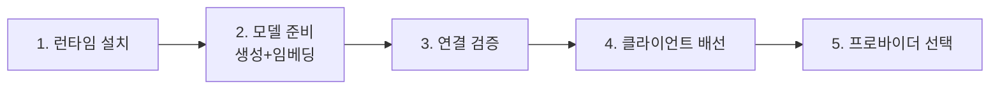

# Ollama로 로컬 모델 구성·연결·프로바이더 선택

이 노트는 [[knowledge/local-llm/index|로컬 LLM]] 허브의 실행 가이드다. "런타임 설치 → 모델 준비 → 연결 검증 → 클라이언트 배선 → 프로바이더 선택" 순서로 정리한다. 실제 운영 환경에서 검증한 패턴을 재구성한 것이며, 비밀값(API 키·토큰)은 노트에 적지 않는다.

## 쉽게 말하면

> **한마디로:** Ollama를 깔면 내 컴퓨터에 **OpenAI 호환 서버**(`localhost:11434`)가 떠서, 기존 도구를 거의 그대로 로컬 모델에 붙일 수 있습니다.

순서는 단순합니다 — 설치 → 모델 준비(생성+임베딩) → 연결 검증 → 클라이언트 배선 → 로컬/클라우드 선택.

## 1. 런타임 설치와 동작 모델

로컬 LLM 런타임은 받은 모델을 OpenAI 호환 HTTP 서버로 띄워 준다. 대표 주자가 **Ollama**다.

- 설치 후 기본 엔드포인트는 `http://localhost:11434`(= `http://127.0.0.1:11434`).
- 두 개의 API 면을 동시에 제공한다.
  - 네이티브 API: `/api/generate`, `/api/embeddings`, `/api/tags`(설치된 모델 목록)
  - OpenAI 호환 API: `/v1/chat/completions`, `/v1/responses` 등
- 처음 호출(cold)은 모델을 메모리에 올리느라 느리고(수십 초까지), 한 번 데워지면(warm) 1초 안팎으로 빨라진다. 첫 응답 지연을 장애로 오해하지 말 것.

대안 런타임도 같은 OpenAI 호환 규약을 따르므로 연결 방식은 유사하다.

- **LM Studio** — GUI 중심, 기본 포트 `1234`
- **vLLM** — 서버급 고성능 추론, 멀티 GPU/배치에 강함

## 2. 모델 준비 — 생성과 임베딩을 분리

로컬에서는 **생성(채팅) 모델**과 **임베딩 모델**을 따로 받아 따로 지정한다. 둘의 역할이 다르기 때문이다.

| 용도 | 예시 모델 | 메모 |
|---|---|---|
| 채팅·추론 | `qwen2.5:3b` | 가볍고 빠름, 요약·간단 작업용 |
| 채팅·추론 | `qwen2.5:7b` | 품질↑, 메모리·지연↑ |
| 임베딩 | `nomic-embed-text` | RAG·의미검색용 벡터 생성(예: 768차원) |

모델을 받은 뒤 `/api/tags`로 설치 목록과 메타데이터(파라미터 수, 양자화 방식 예: `Q4_K_M`, 컨텍스트 길이 예: 32768)를 확인한다.

**모델 크기 고르기 가이드**

- 작업이 분류·요약·태깅·추출처럼 단순하면 3B급으로 충분하다.
- 다단계 추론·구조화 JSON 출력·자기검증 루프가 필요하면 7B 이상을 쓰고, 그래도 불안정하면 14B/32B나 클라우드를 고려한다. (소형 모델은 JSON 파싱은 곧잘 해도 검토·검증 단계의 구조 요건을 매번 채우지는 못한다.)
- 항상 **VRAM/RAM 여유 안에서** 가장 큰 모델을 고르는 게 품질-자원 균형의 출발점이다.

## 3. 연결 검증 — 클라이언트보다 먼저 엔드포인트부터

도구에 붙이기 전에 런타임이 살아 있는지 직접 확인한다.

1. 설치 목록 확인: `/api/tags`에 원하는 모델이 보이는지.
2. 생성 확인: 채팅 모델에 간단한 프롬프트를 던져 정상 응답과 지연을 측정.
3. 임베딩 확인: 임베딩 모델이 기대한 차원의 벡터를 돌려주는지.

이 3단계가 통과해야 그다음 클라이언트 연결 문제를 런타임 문제와 분리해 진단할 수 있다.

## 4. 클라이언트 배선

### 4-1. Obsidian Copilot에 연결 (지식베이스 QA)

[[knowledge/obsidian/index|Obsidian × 생성형 AI]] 흐름에서 Vault를 로컬 모델로 질의하는 구성이다.

- 플러그인 설정에서 **기본 채팅 모델**을 로컬 모델(예: `qwen2.5:7b|ollama`), **기본 임베딩 모델**을 로컬 임베딩(예: `nomic-embed-text|ollama`)로 지정한다.
- Ollama 엔드포인트를 `http://localhost:11434`로 맞춘다.
- 노트 근거(note-grounded) QA를 위해 의미검색·인덱싱을 켜고, 에이전트 도구(로컬 검색·노트 읽기)를 활성화한다. 첫 질의가 실패하면 보통 **인덱싱 미완료**가 원인이니, 시작 시 인덱싱·인덱스 동기화 옵션을 켜고 재시작한다.
- 쓰기 작업은 자동 수락을 끄고(diff 검토 모드) 사람이 확인 후 승인하는 게 안전하다.
- 키체인/키 전용 옵션을 쓰면 활성 모델의 API 키 필드는 빈 문자열로 둔다(로컬은 키가 필요 없다).

> 주의: 설정 파일을 직접 수정할 때는 **수정 전 백업**을 남기고 변경하라. 원본 보존이 우선이다.

### 4-2. 에이전트 오케스트레이터에 연결 (OpenAI 호환 경로)

[[agents-harness/agents/index|AI 에이전트]]·서비스 백엔드가 OpenAI SDK를 쓰고 있다면, **기존 클라우드 경로를 건드리지 않고 가산(additive)** 방식으로 로컬 경로를 추가하는 패턴이 안전하다.

- 환경변수로 로컬 엔드포인트를 주입한다(예: base URL = `http://127.0.0.1:11434/v1`, model = `qwen2.5:7b`). API 키는 런타임이 무시하므로 더미 placeholder를 넣되, 이는 실제 비밀이 아니다.
- 프로바이더 코드에서 **base URL 미설정 → 클라우드 기본 경로, 설정 → 로컬 경로**로 분기한다. 이렇게 하면 클라우드 동작은 무변경(회귀 0)이고 로컬은 추가 선택지가 된다.
- 로컬 호출은 **Chat Completions(`/v1/chat/completions`)** 를 기본으로 쓰는 게 호환성이 가장 넓다. 일부 Ollama 빌드는 `/v1/responses`도 받지만, LM Studio·vLLM 등 다른 런타임까지 고려하면 Chat Completions가 안전한 공통 계약이다.

**운영 함정 — `.env`와 테스트 그린은 상호배타**

로컬 프로바이더를 켜는 환경변수(`AI_PROVIDER=openai` 등)가 있으면 공용 테스트 스위트가 실제 LLM을 때려 mock 기대 테스트가 깨지고 비결정적으로 느려진다. CI·검증 시에는 mock 프로바이더를 쓰거나 해당 환경변수를 비워, 런타임 편의 설정과 테스트 픽스처를 분리하라.

## 5. 프로바이더 선택 기준

| 기준 | 로컬(Ollama 등) | 클라우드 API |
|---|---|---|
| 데이터 민감도 | 높을수록 유리 | 외부 전송 발생 |
| 폐쇄망/오프라인 | 가능 | 불가 |
| 추론 품질 상한 | 모델 크기에 제약 | 최상위 |
| 비용 | 초기 HW 투자 후 한계비용≈0 | 토큰당 과금 |
| 운영 부담 | 직접 관리 | 제공자 관리 |
| 재현성 | 가중치 고정 가능 | 버전 변동 가능 |

**권장 결정 흐름**

1. 데이터가 민감하거나 폐쇄망인가 → 예: **로컬 우선**.
2. 작업이 고난도 추론·고품질 출력을 요구하는가 → 예: **클라우드** 또는 더 큰 로컬 모델.
3. 둘 다 걸치면 **하이브리드 라우팅** — 민감/대량은 로컬, 고난도는 클라우드. 로컬이 구조 요건을 못 채우면 **결정론적 fallback**(클라우드 또는 규칙 기반)으로 떨어지게 안전망을 둔다.

## 6. 보안 체크리스트

- API 키·토큰·credential·`.env` 값을 노트나 발행 콘텐츠에 적지 않는다.
- 설정 파일 수정 전 백업을 남긴다(원본 보존 우선).
- 로컬 더미 키는 비밀이 아니지만, 클라우드 키와 한 파일에 섞지 않는다.
- 비밀값을 담은 파일은 버전관리에서 제외(gitignore)한다.

## 함께 보기

- [[knowledge/local-llm/index|로컬 LLM]] — 허브 랜딩(왜/언제/어떻게)
- [[knowledge/obsidian/index|Obsidian × 생성형 AI]] — Vault 지식베이스 + 로컬 모델 QA
- [[agents-harness/agents/index|AI 에이전트]] — 프로바이더를 도구로 쓰는 에이전트 설계
- [[agents-harness/harness-intro/index|하네스 엔지니어링]] — 검증·거버넌스 표준
