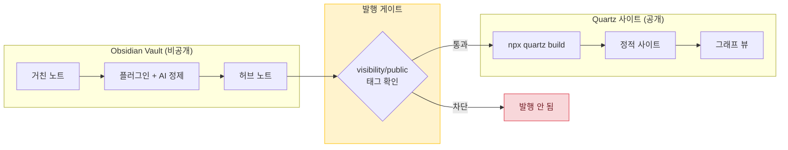

# Obsidian × 생성형 AI

> 마크다운 금고 하나를 **AI의 장기기억**이자 **공개 지식허브**로 동시에 쓰는 방법.

Obsidian Vault는 사람만 보는 노트 앱이 아니다. 잘 설계하면 생성형 AI가 읽고·쓰고·연결하는 **단일 진실원(DB)** 이 되고, 그중 공개해도 되는 노트만 정적 사이트로 흘려보내는 **발행 원천**이 된다. 이 허브는 그 두 역할을 어떻게 한 금고에서 굴리는지 정리한다.

## 쉽게 말하면

> **한마디로:** 마크다운 금고(Obsidian) 하나를 **AI의 장기기억**이자 **이 블로그의 발행 원천**으로 동시에 쓰는 방법을 모은 허브입니다.

비공개로 자유롭게 쌓되, "공개" 태그가 붙은 노트만 정적 사이트로 흘려보냅니다.

## 이 허브의 노트

- [[obsidian-vault|Obsidian Vault (볼트 루트)]] — 모든 AI의 장기기억이 되는 정규 문서 저장소. 고정 폴더 레이아웃, RAG 시맨틱 인덱스, Drive 미러 구조.
- [[ai-plugins|Obsidian + 생성형 AI 플러그인 스택]] — Copilot · Templater · Smart Connections · Local REST API · Excalidraw와 이를 엮은 자동화 패턴.
- [[mywiki-to-quartz-pipeline|MyWiki→Quartz 발행 파이프라인]] — `visibility/public` 태그가 붙은 노트만 단방향으로 사이트에 내보내는 빌드타임 동기화. `[[위키링크]]`·그래프 자동.
- [[quartz-hub-manager|Quartz Hub Manager 플러그인 가이드]] — 옵시디언에서 카테고리·미리보기·배포를 GUI로 관리하는 도구. 메뉴·기능을 다이어그램으로 정리.

## 발행 게이트 파이프라인

*위 다이어그램은 비공개 Obsidian Vault의 노트가 public 게이트웨이를 거쳐 Quartz 정적 사이트로 배포되는 단방향 파이프라인의 구조를 나타냅니다.*

## 큰 그림

1. **쌓는다** — 거친 노트를 Vault에 떨구고, 플러그인과 AI로 distill해 허브 아래 노트로 승격한다.
2. **연결한다** — `[[위키링크]]`와 Smart Connections로 노트를 엮으면, 그래프가 곧 탐색 인터페이스가 된다.
3. **발행한다** — `visibility/public` 게이트를 통과한 노트만 `npx quartz build`로 정적 사이트가 된다. 사이트→위키 역기록은 없다.

## 원칙

- **단일 진실원** — 지식은 Vault에만 쌓고, 노출은 태그로만 통제한다.
- **변환 최소화** — Quartz는 Obsidian 호환이라, 위키 마크다운을 거의 그대로 발행한다.
- **보안 우선** — API키·토큰·PII는 노트에 넣지 않고, 발행 게이트 이전에 차단한다.

## 이웃 허브

- [[knowledge/local-llm/index|로컬 LLM]] — 임베딩·추론을 로컬에서 돌려 데이터 유출면을 줄인다.
- [[agents-harness/agents/index|AI 에이전트]] — Vault를 읽고 쓰는 외부 에이전트 설계.

<!-- auto-children -->

## 이 분류의 문서

- [[ai-plugins|Obsidian + 생성형 AI 플러그인 스택]]
- [[obsidian-vault|Obsidian 볼트 (볼트 루트)]]
- [[quartz-hub-manager|Quartz Hub Manager — 쉽게 보는 사용설명서]]
