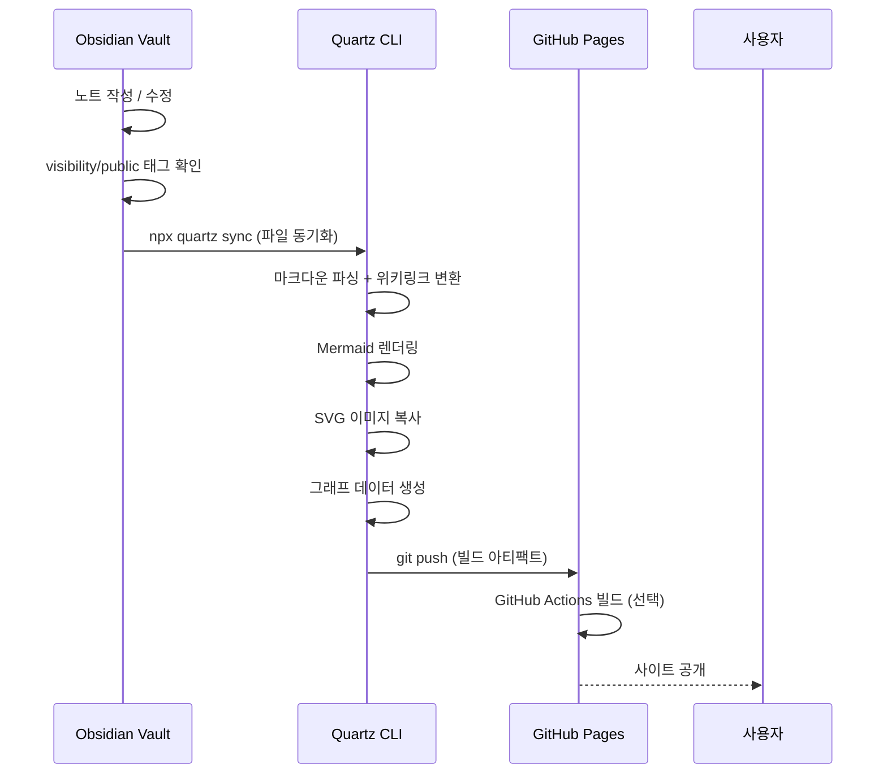

# MyWiki(Obsidian)에서 Quartz로 발행하는 파이프라인

이 사이트는 **위키가 원천(DB), Quartz가 발행물(렌더러)** 이라는 두 역할 분리 위에서 동작한다. 둘 사이의 연결은 SQL 같은 런타임 연결이 아니라 **빌드타임 콘텐츠 동기화**다. 그래서 위키는 자유롭게 쌓고, 노출은 태그 하나로 통제한다.

> [!note] Hugo 파이프라인과의 차이
> 예전 Hugo 발행 파이프라인 (보관됨)은 위키 프론트매터를 Hugo 스키마(`created→date`, 도메인 태그→`categories`)로 변환하는 매핑 단계가 무거웠다. Quartz는 **Obsidian 마크다운을 거의 그대로 읽기 때문에** 그 변환 계층 대부분이 사라진다. `[[위키링크]]`·백링크·그래프가 빌드에서 자동으로 살아나는 것이 핵심 이득이다.

## 흐름 (5단계)

1. **수집(ingest)** — 거친 노트를 위키에 떨구고 distill해 허브(`agents`·`harness`·`obsidian` 등) 아래 노트로 승격한다. 모든 노트는 `title/tags/created/updated` 프론트매터와 `[[위키링크]]`를 가진다.
2. **발행 게이트** — `tags`에 `visibility/public`이 있는 노트만 사이트로 나간다. `visibility/internal`·`visibility/pii`·무표식은 위키에만 남는다. **`pii`는 어떤 경우에도 발행하지 않는다.** Quartz는 추가로 `draft: true`인 노트를 빌드에서 제외하므로, 발행 노트는 `draft: false`(또는 생략)로 둔다.
3. **단방향 복사** — 발행 대상 노트를 `content/<hub>/<slug>.md`로 복사한다. **사이트→위키 역기록은 금지**(원본 보존). 파일명은 영문 kebab-case, 본문은 한국어.
4. **링크·그래프 자동화** — `[[위키링크]]`를 손으로 치환하지 않는다. Quartz가 빌드 시 내부 링크로 해석하고, 끊긴 링크·백링크·그래프 뷰를 자동 생성한다. 위키에서 쓰던 연결 구조가 사이트에서 그대로 탐색 가능해진다.
5. **빌드·배포** — `npx quartz build`로 정적 산출물을 만들고 정적 호스팅(GitHub Pages / Vercel 등)으로 배포한다.

## 배포 자동화 시퀀스


*위 시퀀스 다이어그램은 Obsidian Vault에서의 작업 수정부터 로컬 빌드 검증 및 최종 GitHub Pages 공개까지의 파이프라인 단계를 보여줍니다.*


```bash
# Quartz 빌드 (Git Bash)
cd /d/01_Projects/13_quartz-mywiki-site && npx quartz build
```

## 원칙

- **단일 진실원** — 지식은 위키에만 쌓고, 노출만 `visibility` 태그로 통제한다.
- **단방향** — 사이트는 항상 위키의 하위 사본이다. 사이트에서 고친 내용을 위키로 되돌려 쓰지 않는다.
- **변환 최소화** — Quartz가 Obsidian 호환이므로, 프론트매터·링크를 억지로 변형하지 않는다. 변형이 적을수록 발행 노트와 원본의 드리프트가 줄어든다.
- **안정성 우선** — 무거운 모션·외부 위젯을 피하고 정적 산출물의 성능·안정성을 유지한다. (`prefers-reduced-motion` 존중)
- **보안** — API키·토큰·PII는 노트에 넣지 않는다. 발행 게이트 이전 단계에서 차단한다.

## 체크리스트

- [ ] 발행할 노트에 `visibility/public` 태그가 있는가
- [ ] `draft: true`가 아닌가 (`draft: false` 또는 생략)
- [ ] PII·시크릿이 본문/프론트매터에 없는가
- [ ] 파일명이 영문 kebab-case `.md`인가
- [ ] `[[위키링크]]`를 평문으로 깨뜨리지 않았는가
- [ ] `npx quartz build` 에러 0인가

## Related

- [[obsidian/obsidian-vault|Obsidian Vault]]
- [[obsidian/ai-plugins|Obsidian + 생성형 AI 플러그인]]
- 구버전: Hugo 발행 파이프라인 (보관됨)
