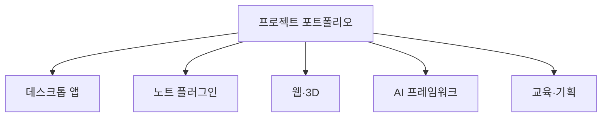

# 프로젝트

> 강의에서 다루는 방법론을 말로만 두지 않으려고, 필요할 때마다 직접 만들어 본 것들입니다. 화려한 출시작이 아니라 **내 작업에서 출발한 실물 기록**입니다. 각 케이스는 무엇을 왜 만들었고, 어떤 스택으로, 지금 어디까지 왔는지를 과장 없이 정리합니다.

## 쉽게 말하면

> **한마디로:** 강의에서 다루는 방법론을 말로만 두지 않으려고 **직접 만들어 본 것들의 모음**입니다. 화려한 출시작이 아니라 솔직한 케이스스터디입니다.

다섯 갈래로 나뉩니다 — 데스크톱 앱, 노트 플러그인, 웹·3D, AI 프레임워크, 교육·기획.

## 데스크톱 앱

- [[notedeck|Notedeck]] — 외부 동기화 없이 내 컴퓨터 안에서만 도는 로컬-퍼스트 스티키 노트 앱(Tauri + Svelte + SQLite).

## 노트 플러그인

- [[obsidian-agent-commands|Obsidian 에이전트 커맨드 허브]] — 여러 AI 코딩 에이전트의 슬래시 커맨드를 노트 안에서 조회·조립·삽입하는 치트시트 겸 빌더.
- [[tmux-workspace-plugin|tmux 워크스페이스 플러그인]] — 버튼 하나로 WSL 안의 tmux 작업 세션을 통째로 띄우는 크로스-OS 생산성 플러그인.

## 웹 · 3D

- [[webgl-gallery|WebGL 인터랙티브 갤러리]] — 관성 스크롤·셰이더·카메라 연출을 실험한 3D 데모 모음(R3F · GSAP · Lenis).
- [[interior-homepage|인테리어 디자인 3D 웹 데모]] — 3D 연출과 단계별 상담 퍼널을 결합한 브랜드 웹 데모(프런트/백 분리).
- [[ruin-to-vision|Ruin to Vision]] — 폐허를 AI로 미래 공간 비전으로 재해석하는 콘텐츠 플랫폼의 웹 MVP.

## AI 프레임워크 · 시스템

- [[ai-ops-console|AI Ops Console]] — 여러 AI 워크플로를 한곳에서 감독·관측하는 운영 콘솔. RAG 수렴과 하이브리드 라우팅을 다룬다.
- [[local-knowledge-system|Local Knowledge System]] — 코드보다 운영 원칙을 먼저 확정하는 Stage 0 방식의 개인 로컬 지식 프레임워크.
- [[design-systems|디자인 시스템 레퍼런스 라이브러리]] — 브랜드의 디자인 언어를 자산이 아닌 방법론(토큰·타이포·레이아웃)으로 정리한 라이브러리.

## 교육 · 기획

- [[investment-edu|투자 교육 콘텐츠 설계]] — 입문에서 심화로 이어지는 10부 한국어 커리큘럼 기획.
- [[sns-management|SNS 관리 시스템 설계]] — 멀티테넌시·토큰 보안·발행 멱등성을 중심에 둔 발행 플랫폼의 데이터 모델 기획.

## 대표 제품

포트폴리오 중 제품으로 다듬고 있는 두 가지는 [[business/products/index|제품]] 허브에서 따로 다룹니다.

- [[peek|Peek]] — AI 작업 상태를 화면 구석에 항상 보이게 띄우는 데스크톱 위젯.
- [[channeldock|ChannelDock]] — 여러 SNS에 한 번에 기획·예약·발행하는 SNS 발행 플랫폼.

## 함께 보기

- [[business/products/index|제품]] — 위 프로젝트 중 제품화 단계로 넘어간 결과물.
- [[agents-harness/agents/index|AI 에이전트]] · [[agents-harness/harness-intro/index|하네스 엔지니어링]] — 이 프로젝트들에 적용한 운영 방법론.
