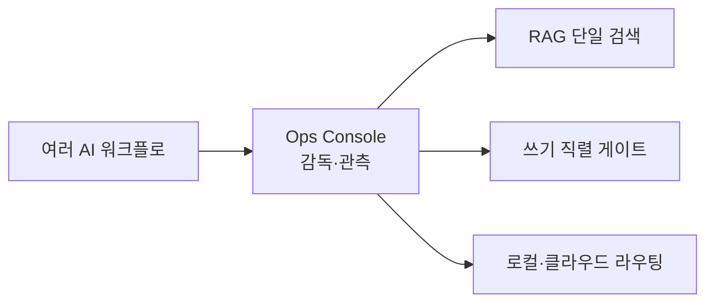

# AI Ops Console — 멀티-AI 운영 감독 콘솔

여러 AI 워크플로를 한곳에서 감독하고 관측하는 운영 콘솔 프레임워크다.

## 쉽게 말하면

> **한마디로:** 여러 AI 워크플로가 **각자 따로 돌며 충돌하는 문제**를, 한곳에서 감독·관측하는 운영 콘솔로 묶은 케이스입니다. 진짜 문제는 새 기술이 아니라 "수렴과 관측의 부재"였습니다.

흩어진 검색 엔진을 하나로 합치고, 쓰기는 사람 승인 아래 직렬로, 모델은 로컬/클라우드로 라우팅합니다.

## 배경 / 문제

개인 AI 환경이 커지면서 지식베이스를 색인하는 RAG 엔진과 에이전트 허브가 중복으로 난립했다. 어떤 에이전트가 어떤 검색 두뇌·모델을 쓰는지 추적이 어렵고, 다중 AI가 동시에 파일을 건드리며 충돌이 났다. 진짜 문제는 새 기술 부족이 아니라 **수렴과 관측의 부재**였다.

## 접근 · 기술 스택

- **모델 통합**: 클라우드/로컬 모델을 OpenAI 호환 엔드포인트 하나로 묶고, Ollama 기반 로컬 모델 와이어링을 가산 방식으로 추가(클라우드 경로 무변경).
- **RAG 수렴**: 흩어진 색인 엔진을 단일 상주(resident) Retrieval 서비스로 통합하고, cross-encoder 리랭커로 가장 약한 고리(리랭킹·환각 제어)를 보강.
- **에이전트 진단**: 플래너의 자기교정 루프를 도입해 계획 생성 결과를 자동 검토·검증.
- **워크플로 거버넌스**: "병렬로 생각하되 쓰기는 직렬로" 게이트 정책으로, 다중 AI 출력을 사람 승인 아래에서만 기록.

## 상태 / 배운 점

초기 단계이며 B2B를 포함한 운영 시나리오를 검증 중이다. 핵심 교훈: 소형 로컬 모델(7B급)은 단순 파싱엔 안정적이지만 다단계 검토·검증에서는 흔들린다. 따라서 민감·대량 작업은 로컬, 고난도 추론은 클라우드로 보내는 **하이브리드 라우팅**이 현실적이다.

## 함께 보기

- [[knowledge/local-llm/index|로컬 LLM]] — 로컬 모델 실행·연결과 하이브리드 라우팅의 판단 기준
- [[agents-harness/agents/index|AI 에이전트]] — 감독 대상이 되는 에이전트 설계
- [[agents-harness/harness-intro/index|하네스 엔지니어링]] — 다중 AI 협업·검증 거버넌스
