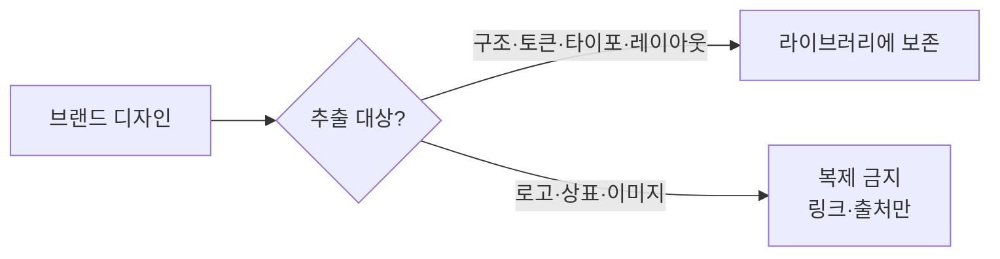

# 디자인 시스템 레퍼런스 라이브러리

여러 브랜드의 디자인 언어를 "복제 가능한 자산"이 아니라 "재사용 가능한 방법론"으로 정리하는 로컬 레퍼런스 라이브러리다.

## 쉽게 말하면

> **한마디로:** 잘 만든 브랜드의 디자인에서 **"방법(토큰·타이포·레이아웃 원칙)"만 빌리고, "자산(로고·상표·이미지)"은 복제하지 않는** 레퍼런스 라이브러리입니다.

벤치마킹은 품질 기준을 빌리는 것이지 자산을 베끼는 게 아니라는 원칙을 처음부터 규칙으로 못박았습니다.

## 배경 / 문제

새 UI를 만들 때마다 색·간격·타이포를 즉흥적으로 정하면 결과물이 매번 흔들린다. 동시에 외부 브랜드를 참고할 때 로고·상표·이미지를 그대로 가져오면 저작권·상표권 문제가 생긴다. 영감과 침해의 경계를 운영 규칙으로 못 박을 필요가 있었다.

## 접근 · 방법론

각 브랜드 프로필에서 추출하는 것은 구조뿐이다 — 색상 스케일, 타이포 위계, 간격 리듬, 레이아웃·인터랙션 원칙. 로고, 고유 문구, 사진 자산은 절대 복제하지 않고 링크와 요약으로만 보존한다. 공통 토큰(CSS 변수·JSON)과 컴포넌트 패턴을 색인으로 묶고, 외부 자산은 출처·라이선스를 매니페스트에 기록해 추적 가능하게 둔다.

## 상태 / 배운 점

다수의 브랜드 프로필과 토큰·컴포넌트 색인이 정리된 상태다. 핵심 교훈은 "벤치마킹은 품질 기준을 빌리는 것이지 자산을 빌리는 것이 아니다"라는 점. 추출 대상(원칙)과 금지 대상(상표·이미지)을 처음부터 분리하니, 빠른 참고와 라이선스 안전성을 동시에 지킬 수 있었다.
