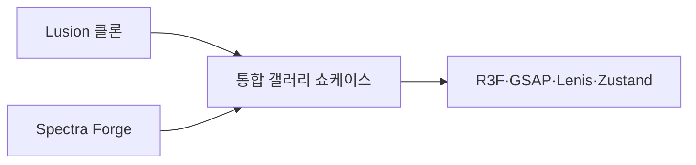

브라우저에서 3D와 모션 인터랙션을 실험한 WebGL 갤러리 데모 모음입니다. 세 개의 데모를 하나의 포트폴리오로 묶었습니다.

## 쉽게 말하면

> **한마디로:** 브라우저에서 **관성 스크롤·셰이더·카메라 연출**을 실험한 3D 데모 3개를 하나의 쇼케이스로 묶은 학습용 프로젝트입니다.

## 배경 / 문제

"스크롤하면 페이지가 위로 움직인다"는 평범한 웹 경험을 넘어서, 관성 스크롤과 셰이더, 카메라 연출이 어우러진 몰입형 인터랙션을 직접 구현해 보고 싶었습니다. 레퍼런스 사이트의 감각을 분해하고 재조립하는 학습이 목표였습니다.

## 접근 · 기술 스택

- **Lusion 클론** — 고급 스튜디오 사이트의 관성 스크롤과 장면 전환을 모사한 학습용 데모
- **Spectra Forge** — 셰이더와 색감 중심의 비주얼 실험
- **통합 갤러리** — 위 데모들을 라우트로 묶어 메뉴에서 탐색하는 쇼케이스

공통 스택은 Next.js + React Three Fiber(Three.js) 기반에 GSAP로 타임라인 모션을, Lenis로 부드러운 관성 스크롤을, Zustand로 상태를 관리했습니다. 셰이더 작성과 카메라 워크, 스크롤 동기화가 핵심 실험 포인트였습니다.

## 상태 / 배운 점

데모 단계로, 세 실험을 한 앱에 통합해 라우팅까지 정리했습니다. 선언형 R3F로 3D 씬을 구성하니 React 사고방식 그대로 장면을 다룰 수 있었고, 스크롤·모션·렌더링을 분리해 관리하는 구조의 중요성을 체감했습니다.
